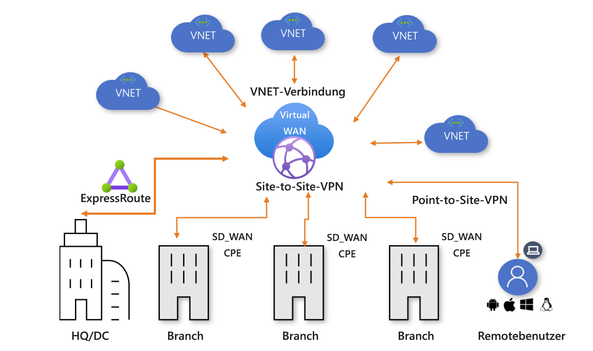

# Informationen zu Azure Virtual WAN

Der Netzwerkdienst Azure Virtual WAN bietet optimierte und automatisierte Branch-Konnektivität mit und durch Azure. Azure-Regionen dienen als Hubs, die Sie auswählen können, um Branches mit ihnen zu verbinden. Sie können das Azure-Backbone nutzen, um auch Verbindungen mit Branches herzustellen und die Branch-to-VNET-Konnektivität zu nutzen. Wir haben eine Liste von Partnern, die die Automatisierung der Konnektivität mit Azure Virtual WAN-VPN unterstützen. Weitere Informationen finden Sie in dem Artikel [Virtual WAN-Partner und -Standorte](virtual-wan-locations-partners.md).

Azure Virtual WAN vereint zahlreiche Azure-Cloudkonnektivitätsdienste, z. B. Site-to-Site-VPN, Benutzer-VPN (Point-to-Site) und ExpressRoute in einer einzigen Betriebsschnittstelle. Die Konnektivität mit Azure-VNets wird mithilfe virtueller Netzwerkverbindungen hergestellt. Die [Architektur mit einem globalen Transitnetzwerk](virtual-wan-global-transit-network-architecture.md) basiert auf einem klassischen Hub-Spoke-Konnektivitätsmodell, bei dem der in der Cloud gehostete Netzwerkhub Übertragungsverbindungen zwischen Endpunkten ermöglicht, die sich in unterschiedlichen Spokes befinden.

Dieser Artikel enthält eine kurze Übersicht über die Netzwerkkonnektivität in Azure Virtual WAN. Virtual WAN hat die folgenden Vorteile:

* **Integrierte Konnektivitätslösungen (Hub & Spoke):** Automatisieren Sie die Site-to-Site-Konfiguration und -Konnektivität zwischen lokalen Standorten und einem Azure-Hub.
* **Automatisierte Spoke-Einrichtung und -Konfiguration:** Verbinden Sie Ihre virtuellen Netzwerke und Workloads nahtlos mit dem Azure-Hub.
* **Intuitive Problembehandlung:** Sie können den gesamten Datenfluss in Azure anzeigen und diese Informationen nutzen, um erforderliche Aktionen durchzuführen.

## Virtuelle WANs des Typs „Basic“ und „Standard“

Es gibt zwei Arten virtueller WANs: Basic und Standard. Die folgende Tabelle zeigt die verfügbaren Konfigurationen für die beiden Typen.

[!INCLUDE [Basic and Standard SKUs](../../includes/virtual-wan-standard-basic-include.md)]

Anweisungen für ein Upgrade eines virtuellen WAN finden Sie unter [Upgrade eines virtuellen WAN von Basic auf Standard](upgrade-virtual-wan.md).

## Virtual WAN-Ressourcen

Sie erstellen die folgenden Ressourcen, um ein virtuelles End-to-End-WAN zu konfigurieren:

* **virtualWAN:** Die Ressource „virtualWAN“ stellt eine virtuelle Überlagerung Ihres Azure-Netzwerks dar und ist eine Sammlung aus mehreren Ressourcen. Sie enthält Links zu allen virtuellen Hubs, die Teil des virtuellen WAN sein sollen. Virtual WAN-Ressourcen sind voneinander isoliert und können keinen gemeinsamen Hub enthalten. Virtuelle Hubs in Virtual WAN kommunizieren nicht miteinander.

* **Hub:** Ein virtueller Hub ist ein von Microsoft verwaltetes virtuelles Netzwerk. Der Hub enthält verschiedene Dienstendpunkte zum Ermöglichen von Konnektivität. In Ihrem lokalen Netzwerk (vpnsite) können Sie sich innerhalb des virtuellen Hubs mit einer VPN Gateway-Instanz verbinden, ExpressRoute-Leitungen mit einem virtuellen Hub verbinden oder sogar mobile Benutzer mit einem Point-to-Site-Gateway im virtuellen Hub verbinden. Der Hub ist der Kern Ihres Netzwerks in einer Region. Es kann nur ein Hub pro Azure-Region vorhanden sein.

  Ein Hub-Gateway ist nicht das gleiche wie ein Gateway für virtuelle Netzwerke, das Sie für ExpressRoute und VPN Gateway verwenden. Bei der Verwendung von Virtual WAN erstellen Sie beispielsweise von Ihrer lokalen Site aus keine direkte Site-to-Site-Verbindung mit Ihrem VNET. Stattdessen erstellen Sie eine Site-to-Site-Verbindung mit dem Hub. Der Datenverkehr verläuft immer über das Hub-Gateway. Dies bedeutet, dass Ihre VNETs kein eigenes Gateway für virtuelle Netzwerke benötigen. Mit Virtual WAN können Sie für Ihre VNETs über den virtuellen Hub und das virtuelle Hub-Gateway leicht eine Skalierung durchführen.

* **Virtuelle Netzwerkverbindung für Hub:** Die Ressource für die virtuelle Netzwerkverbindung für den Hub wird verwendet, um den Hub nahtlos mit Ihrem virtuellen Netzwerk zu verbinden.

* **(Vorschau) Hub-zu-Hub-Verbindung**: In einem virtuellen WAN sind alle Hubs miteinander verbunden. Dies bedeutet, dass mit einem lokalen Hub verbundene Niederlassungen, Benutzer oder VNETs mit einer anderen Niederlassung oder anderen VNETs mithilfe der vollständig vernetzten Architektur der verbundenen Hubs kommunizieren können. Sie können auch über das vernetzte Hub-zu-Hub-Framework VNETs innerhalb eines Hubs, der durch den virtuellen Hub führt, sowie VNETs zwischen Hubs verbinden.

* **Hubroutingtabelle:**  Sie können eine virtuelle Hubroute erstellen und die Route der Routingtabelle des virtuellen Hubs zuweisen. Sie können der Routingtabelle des virtuellen Hubs mehrere Routen zuweisen.

**Zusätzliche Virtual WAN-Ressourcen**

  * **Site:** Diese Ressource wird ausschließlich für Site-to-Site-Verbindungen verwendet. Die Ressource „site“ ist **vpnsite**. Sie stellt Ihr lokales VPN-Gerät und die zugehörigen Einstellungen dar. Durch die Zusammenarbeit mit einem Virtual WAN-Partner verfügen Sie über eine integrierte Lösung zum automatischen Exportieren dieser Informationen nach Azure.

## Konnektivität

Virtual WAN lässt die folgenden Konnektivitätstypen zu: Site-to-Site-VPN, Benutzer-VPN (Point-to-Site) und ExpressRoute.

### Site-to-Site-VPN-Verbindungen

Wenn Sie in Virtual WAN eine Site-to-Site-Verbindung einrichten, können Sie mit einem verfügbaren Partner arbeiten. Wenn Sie keinen Partner verwenden möchten, können Sie die Verbindung manuell konfigurieren. Weitere Informationen finden Sie unter [Erstellen einer Site-to-Site-Verbindung per Virtual WAN](virtual-wan-site-to-site-portal.md).

#### Workflow für Virtual WAN-Partner

Wenn Sie mit einem Virtual WAN-Partner arbeiten, ist der Workflow wie folgt:

1. Der Controller des Zweigstellengeräts (VPN/SDWAN) wird authentifiziert, um standortbezogene Informationen mithilfe eines [Azure-Dienstprinzipals](../active-directory/develop/howto-create-service-principal-portal.md) zu exportieren.
2. Der Controller des Branchgeräts (VPN/SDWAN) ruft die Azure-Konnektivitätskonfiguration ab und aktualisiert das lokale Gerät. So werden für das lokale VPN-Gerät der Konfigurationsdownload und die Bearbeitung und die Aktualisierung automatisiert.
3. Nachdem das Gerät über die richtige Azure-Konfiguration verfügt, wird eine Site-to-Site-Verbindung (zwei aktive Tunnel) mit dem Azure WAN eingerichtet. Azure unterstützt IKEv1 und IKEv2. BGP ist optional.

#### Partner für Site-to-Site-Verbindungen in Virtual WAN

Eine Liste der verfügbaren Partner und Standorte finden Sie in dem Artikel [Virtual WAN-Partner und -Standorte](virtual-wan-locations-partners.md).

### Benutzer-VPN-Verbindungen (Point-to-Site)

Sie können sich über eine IPsec/IKE (IKEv2)- oder OpenVPN-Verbindung mit Ihren Ressourcen in Azure verbinden. Für diese Art von Verbindung muss auf dem Clientcomputer ein VPN-Client konfiguriert sein. Weitere Informationen finden Sie unter [Herstellen einer Point-to-Site-Verbindung](virtual-wan-point-to-site-portal.md).

### ExpressRoute-Verbindungen
Mit ExpressRoute können Sie Ihr lokales Netzwerk über eine private Verbindung mit Azure verbinden. Informationen zum Erstellen der Verbindung finden Sie unter [Erstellen einer ExpressRoute-Verbindung per Virtual WAN](virtual-wan-expressroute-portal.md).

## Standorte

Informationen zu Standorten finden Sie in dem Artikel [Virtual WAN-Partner und -Standorte](virtual-wan-locations-partners.md).

## Häufig gestellte Fragen

[!INCLUDE [Virtual WAN FAQ](../../includes/virtual-wan-faq-include.md)]

## Nächste Schritte

[Erstellen einer Site-to-Site-Verbindung per Azure Virtual WAN](virtual-wan-site-to-site-portal.md)
