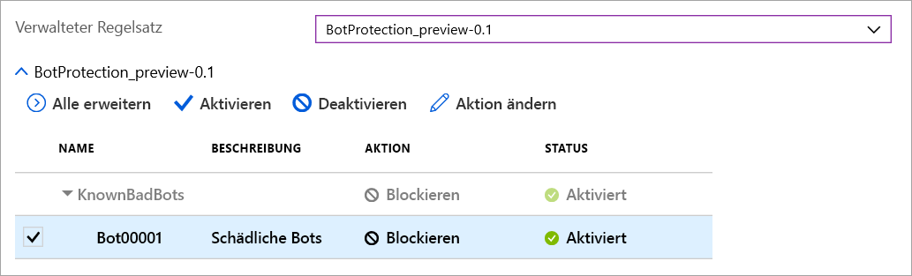

# Azure Web Application Firewall für Azure Front Door

Azure Web Application Firewall (WAF) für Azure Front Door bietet zentralen Schutz für Ihre Webanwendungen, die mithilfe von Azure Front Door global bereitgestellt werden. WAF wurde zum Schutz Ihrer Webdienste vor allgemeinen Exploits und Sicherheitsrisiken entwickelt und sorgt im Betrieb für die ständige Hochverfügbarkeit Ihrer Dienste für die Benutzer. Außerdem hilft es Ihnen dabei, Ihre Compliance-Anforderungen zu erfüllen.

WAF für Front Door ist eine globale und zentrale Lösung. WAF wird an Edge-Standorten des Azure-Netzwerks auf der ganzen Welt bereitgestellt und untersucht am Netzwerk-Edge jede eingehende Anforderung für eine WAF-fähige, von Front Door bereitgestellte Webanwendung. So ist WAF mit seinem globalen bedarfsabhängigen Schutz ohne Leistungseinbußen näher an der Angriffsquelle und kann böswilllige Angriffe bereits abwehren, bevor sie das virtuelle Netzwerk erreichen. Eine WAF-Richtlinie kann problemlos mit jedem Front Door-Profil in Ihrem Abonnement verknüpft werden. Neue Regeln werden innerhalb weniger Minuten bereitgestellt, damit Sie schnell auf wechselnde Bedrohungsmuster reagieren können.

## WAF-Richtlinien und -Regeln

Sie können eine WAF-Richtlinie konfigurieren und diese Richtlinie einem oder mehreren Front Door-Front-Ends als Schutz zuordnen. Eine WAF-Richtlinie besteht aus zwei verschiedenen Arten von Sicherheitsregeln:

- benutzerdefinierte Regeln, die vom Kunden erstellt werden

- verwaltete Regelsätze (d.h. eine Sammlung von vorkonfigurierten Regelsätzen, die von Azure verwaltet werden)

Wenn beides vorhanden ist, werden die benutzerdefinierten Regeln vor den Regeln eines verwalteten Regelsatzes verarbeitet. Eine Regel besteht aus einer Übereinstimmungsbedingung, einer Priorität und einer Aktion. Folgende Aktionstypen werden unterstützt: ALLOW, BLOCK, LOG und REDIRECT. Sie können eine vollständig angepasste Richtlinie erstellen, die Ihre speziellen Anforderungen an die Anwendungssicherheit erfüllt, indem Sie verwaltete und benutzerdefinierte Regeln kombinieren.

Regeln in einer Richtlinie werden in einer Prioritätsreihenfolge verarbeitet, wobei eine eindeutige Ganzzahl die Priorität und damit die Reihenfolge der Regelverarbeitung definiert. Kleinere ganzzahlige Wert geben eine höhere Priorität an und werden vor den Regeln mit einem höheren ganzzahligen Wert ausgewertet. Sobald eine Übereinstimmung mit einer Regel erkannt wird, wird die entsprechende Aktion, die in der Regel definiert wurde, auf die Anforderung angewendet. Wurde eine derartige Übereinstimmung verarbeitet, werden die Regeln mit niedrigerer Priorität nicht weiter verarbeitet.

Einer von Front Door bereitgestellten Webanwendung kann jeweils nur eine WAF-Richtlinie zugeordnet werden. Sie können jedoch eine Front Door-Konfiguration auch ohne eine zugehörige WAF-Richtlinie erstellen. Wenn eine WAF-Richtlinie vorhanden ist, wird sie in all unsere Edge-Standorte repliziert, um bei den Sicherheitsrichtlinien auf der ganzen Welt Konsistenz zu gewährleisten.

## WAF-Modi

Für die Ausführung der WAF-Richtlinie können die beiden folgenden Modi konfiguriert werden:

- **Erkennungsmodus:** Bei der Ausführung im Erkennungsmodus überwacht WAF nur die Anforderung und die entsprechende WAF-Regel und protokolliert die Ergebnisse im WAF-Protokoll. Es werden keine anderen Aktionen ausgeführt. Sie können die Protokollierung von Diagnosedaten für Front Door aktivieren. (Wechseln Sie dazu im Azure-Portal zum Abschnitt **Diagnose**.)

- **Schutzmodus:** Wenn für WAF die Ausführung im Schutzmodus konfiguriert ist und eine Anforderung einer Regel entspricht, führt WAF die entsprechende Aktion aus. Nachdem eine Übereinstimmung gefunden wurde, werden keine weiteren Regeln mit niedrigerer Priorität mehr ausgewertet. Jede Anforderung mit einer Regelübereinstimmung wird außerdem in den WAF-Protokollen protokolliert.

## WAF-Aktionen

Für WAF-Kunden stehen die folgenden Aktionen zur Auswahl, die beim Erfüllen einer Regelbedingung durch eine Anforderung ausgeführt werden:

- **Zulassen**:  Die Anforderung passiert die WAF und wird an das Back-End weitergeleitet. Diese Anforderung kann mit Regeln niedrigerer Priorität nicht mehr gesperrt werden.
- **BLOCK:** Die Anforderung wird gesperrt. WAF sendet eine Antwort an den Client, ohne die Anforderung an das Back-End weiterzuleiten.
- **LOG:**  Die Anforderung wird in den WAF-Protokollen protokolliert, und WAF setzt den Vorgang mit dem Auswerten von Regeln mit niedriger Priorität fort.
- **REDIRECT:** WAF leitet die Anforderung an den angegebenen URI weiter. Der URI wird als Einstellung auf Richtlinienebene angegeben. Nach der Konfiguration werden alle Anforderungen, die der Aktion **REDIRECT** entsprechen, an diesen URI gesendet.

## WAF-Regeln

Eine WAF-Richtlinie kann aus zwei Arten von Sicherheitsregeln bestehen: benutzerdefinierte, vom Kunden erstellte Regeln und verwaltete Regelsätze (von Azure verwaltete, vorkonfigurierte Regelsätze).

### Benutzerdefinierte Regeln

Sie können benutzerdefinierte WAF-Regeln wie folgt konfigurieren:

- **Liste zugelassener und gesperrter IP-Adressen**: Sie können benutzerdefinierte Regeln zum Steuern des Zugriffs auf Ihre Webanwendungen anhand einer Liste von Client-IP-Adressen (oder IP-Adressbereichen) konfigurieren. Unterstützt werden sowohl IPv4- als auch IPv6-Adresstypen. Diese Liste können Sie so konfigurieren, dass Anforderungen, deren Quell-IP-Adresse mit einer IP-Adresse in der Liste übereinstimmt, entweder gesperrt oder zugelassen werden.

- **Geografiebasierte Zugriffssteuerung**: Sie können benutzerdefinierte Regeln konfigurieren, um den Zugriff auf Ihre Webanwendungen anhand des Ländercodes einer Client-IP-Adresse zu steuern.

- **Zugriffssteuerung auf Basis von HTTP-Parametern:** Sie können benutzerdefinierte Regeln anhand von Zeichenfolgen konfigurieren, die mit HTTP/HTTPS-Anforderungsparametern (z.B. Abfragezeichenfolgen, POST-Argumente, Anforderungs-URI, Anforderungsheader und Anforderungstext) übereinstimmen.

- **Zugriffssteuerung auf Basis der Anforderungsmethode:** Sie können benutzerdefinierte Regeln anhand der HTTP-Anforderungsmethode der Anforderung (z.B. GET, PUT oder HEAD) konfigurieren.

- **Größenbeschränkung:** Sie können benutzerdefinierte Regeln anhand der Länge bestimmter Teile einer Anforderung (z.B. Abfragezeichenfolge, URI oder Anforderungstext) konfigurieren.

- **Ratenbegrenzungsregeln:** Eine Regel für die Ratensteuerung dient dazu, ungewöhnlich umfangreichen Datenverkehr von beliebigen Client-IP-Adressen zu beschränken. Sie können einen Schwellenwert für die Anzahl der Webanforderungen konfigurieren, die von einer Client-IP-Adresse während einer Minute zulässig sind. Dies unterscheidet sich von der benutzerdefinierten Regel mit einer Liste zugelassener oder gesperrter IP-Adressen, die alle Anforderungen von einer Client-IP-Adresse entweder zulässt oder sperrt. Für eine noch präzisere Ratensteuerung kann die Ratenbegrenzung mit weiteren Übereinstimmungsbedingungen (z.B. HTTP-Parametern) kombiniert werden.

### Von Azure verwaltete Regelsätze

Von Azure verwaltete Regelsätze bieten eine einfache Möglichkeit zum Bereitstellen von Schutz vor allgemeinen Sicherheitsbedrohungen. Da Azure diese Regelsätze verwaltet, werden die Regeln zum Schutz vor neuen Angriffssignaturen aktualisiert, wenn dies erforderlich ist. In der öffentlichen Vorschauversion enthält der von Azure verwaltete Standardregelsatz Regeln für die folgenden Bedrohungskategorien:

- Cross-Site-Scripting
- Java-Angriffe
- Local File Inclusion
- PHP Code-Injection
- Remotebefehlsausführung
- Remote File Inclusion
- Session Fixation
- Schutz vor Einschleusung von SQL-Befehlen
- Protokollangreifer

Die Versionsnummer des Standardregelsatzes wird erhöht, wenn dem Regelsatz neue Angriffssignaturen hinzugefügt werden.
Der Standardregelsatz wird standardmäßig im Erkennungsmodus in den WAF-Richtlinien aktiviert. Sie können einzelne Regeln im Standardregelsatz deaktivieren bzw. aktivieren, um die Anforderungen Ihrer Anwendungen zu erfüllen. Sie können pro Regel auch bestimmte Aktionen (ALLOW/BLOCK/REDIRECT/LOG) festlegen. Standardaktion ist BLOCK. Außerdem können in der gleichen WAF-Richtlinie auch benutzerdefinierte Regeln konfiguriert werden, wenn Sie eine der vorkonfigurierten Regeln im Standardregelsatz umgehen möchten.
Benutzerdefinierte Regeln werden immer vor den Regeln im Standardregelsatz ausgewertet. Wenn eine Anforderung mit einer benutzerdefinierten Regel übereinstimmt, wird die entsprechende Regelaktion angewendet, und die Anforderung wird entweder gesperrt oder an den Back-End weitergeleitet, ohne weitere benutzerdefinierte Regeln oder Regeln im Standardregelsatz aufzurufen. Darüber hinaus haben Sie die Möglichkeit, den Standardregelsatz aus Ihren WAF-Richtlinien zu entfernen.

### Bot-Schutzregel (Vorschauversion)

Ein verwalteter Bot-Schutzregelsatz kann für Ihre WAF aktiviert werden, damit bei Anforderungen von IP-Adressen, die als schädlich bekannt sind, benutzerdefinierte Aktionen ausgeführt werden können. Die IP-Adressen stammen aus dem Microsoft Threat Intelligence-Feed. Microsoft Threat Intelligence basiert auf [Intelligent Security Graph](https://www.microsoft.com/security/operations/intelligence) und wird von mehreren Diensten einschließlich Azure Security Center verwendet.

> [!IMPORTANT]
> Bot-Schutzregelsatz befindet sich derzeit in der öffentlichen Vorschau und wird mit einer Vorschau-SLA (Vereinbarung zum Servicelevel) bereitgestellt. Manche Features werden möglicherweise nicht unterstützt oder sind nur eingeschränkt verwendbar.  Weitere Informationen finden Sie unter [Ergänzende Nutzungsbedingungen für Microsoft Azure-Vorschauversionen](https://azure.microsoft.com/support/legal/preview-supplemental-terms/).

Wenn der Bot-Schutz aktiviert ist, werden eingehende Anforderungen, die mit Client-IPs von schädlichen Bots übereinstimmen, im Protokoll „FrontdoorWebApplicationFirewallLog“ protokolliert. Sie können auf WAF-Protokolle per Speicherkonto, Event Hub oder Log Analytics zugreifen. 

## Konfiguration

Das Konfigurieren und Bereitstellen von allen WAF-Regelarten wird für das Azure-Portal, REST-APIs, Azure Resource Manager-Vorlagen und Azure PowerShell vollständig unterstützt.

## Überwachung

Die Überwachung für WAF für Front Door ist in Azure Monitor integriert und dient zum Nachverfolgen von Warnungen und zum einfachen Überwachen von Datenverkehrstrends.

## Nächste Schritte

- Weitere Informationen zu [Web Application Firewall für Azure Application Gateway](../ag/ag-overview.md)