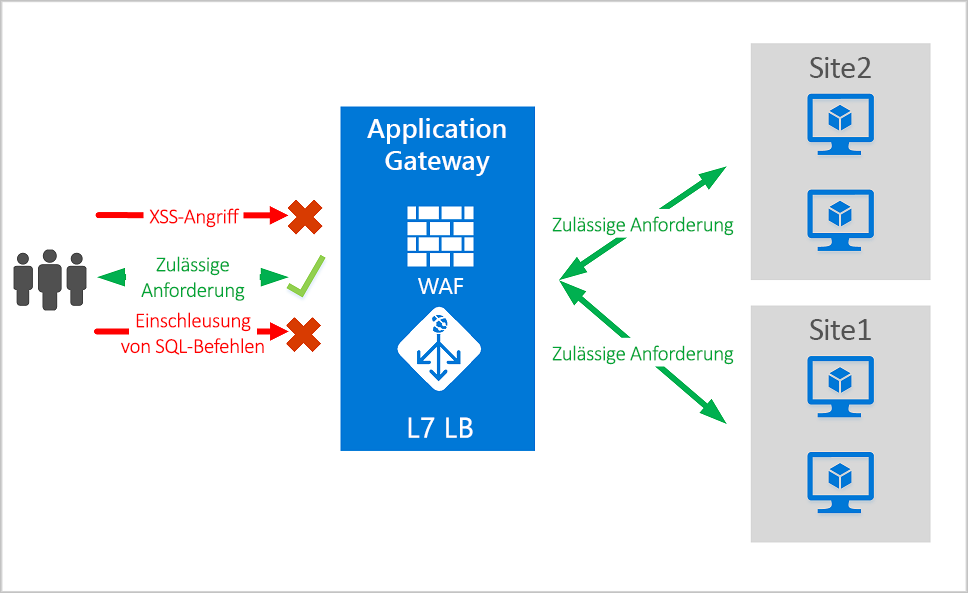
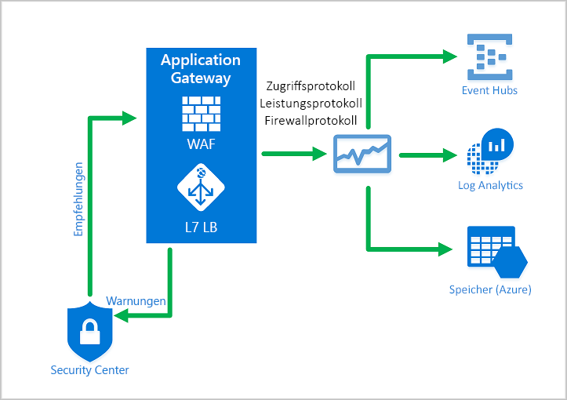
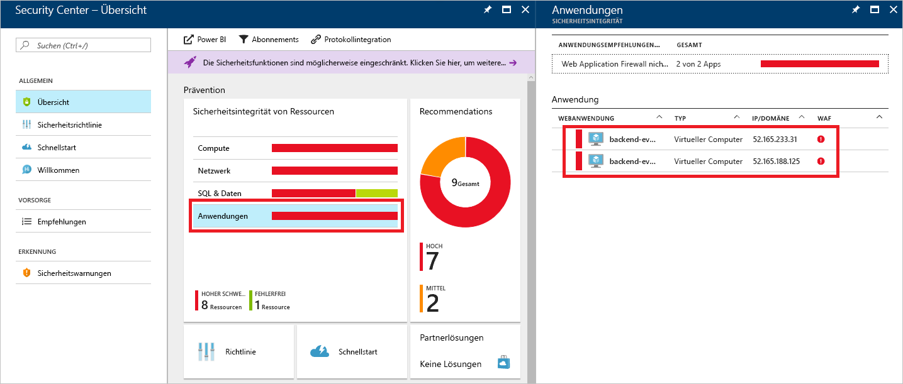
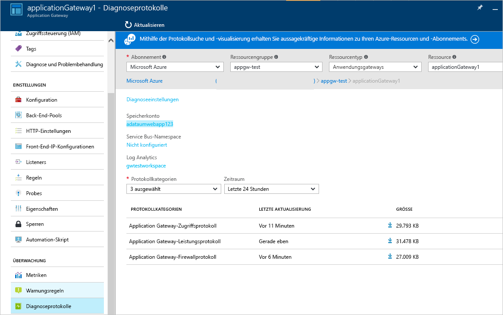

# <a name="azure-web-application-firewall-on-azure-application-gateway"></a>Azure Web Application Firewall für Azure Application Gateway

Die Azure Web Application Firewall (WAF) für Application Gateway bietet zentralisierten Schutz vor verbreiteten Exploits und Sicherheitsrisiken für Ihre Webanwendungen. Webanwendungen sind zunehmend Ziele böswilliger Angriffe, die allgemein bekannte Sicherheitslücken ausnutzen. Einschleusung von SQL-Befehlen und websiteübergreifendes Skripting gehören zu den häufigsten Angriffen.

Die WAF für Application Gateway basiert auf der Version 3.1, 3.0 oder 2.2.9 des [Kernregelsatzes (Core Rule Set, CRS)](https://www.owasp.org/index.php/Category:OWASP_ModSecurity_Core_Rule_Set_Project) aus dem Open Web Application Security Project (OWASP). Die WAF wird automatisch aktualisiert und bietet Schutz vor neuen Sicherheitsrisiken, ohne dass zusätzliche Konfiguration erforderlich ist. 

Alle unten aufgeführten WAF-Features befinden sich innerhalb einer WAF-Richtlinie. Sie können mehrere Richtlinien erstellen, und diese können einer Application Gateway-Instanz, einzelnen Listenern oder pfadbasierten Routingregeln für eine Application Gateway-Instanz zugeordnet werden. Dadurch können Sie bei Bedarf separate Richtlinien für jede Website hinter Ihrer Application Gateway-Instanz verwenden. Weitere Informationen zu WAF-Richtlinien finden Sie unter [Erstellen von Web Application Firewall-Richtlinien für Application Gateway](create-waf-policy-ag.md).

   > [!NOTE]
   > WAF-Richtlinien für einzelne Websites und URIs befinden sich in der Public Preview-Phase. Das bedeutet, dass diese Funktion den zusätzlichen Nutzungsbedingungen von Microsoft unterliegt. Weitere Informationen finden Sie unter [Zusätzliche Nutzungsbestimmungen für Microsoft Azure-Vorschauen](https://azure.microsoft.com/support/legal/preview-supplemental-terms/).



Application Gateway wird als Application Delivery Controller (ADC, Controller zur Anwendungsbereitstellung) betrieben. Die Anwendung bietet SSL-Terminierung (Secure Sockets Layer), cookiebasierte Sitzungsaffinität, Lastverteilung per Roundrobin, inhaltsbasiertes Routing, die Möglichkeit zum Hosten mehrerer Websites sowie Sicherheitsverbesserungen.

Zu den Sicherheitsverbesserungen von Application Gateway gehören die SSL-Gruppenrichtlinienverwaltung sowie umfassende End-to-End-Unterstützung. Die Anwendungssicherheit wird von der WAF-Integration in Application Gateway gestärkt. Die Kombination schützt Ihre Webanwendungen vor gängigen Sicherheitslücken. Außerdem bietet sie einen einfach konfigurierbaren zentralen Verwaltungsort.

## <a name="benefits"></a>Vorteile

In diesem Abschnitt werden die wichtigsten Vorteile der WAF für Application Gateway beschrieben.

### <a name="protection"></a>Schutz

* Schützen Sie Ihre Webanwendungen vor Sicherheitsrisiken und Angriffen im Web, ohne den Back-End-Code zu verändern.

* Schützen Sie mehrere Webanwendungen gleichzeitig. Eine Instanz von Application Gateway kann bis zu 40 Websites hosten, die mit einer Web Application Firewall geschützt sind.

* Erstellen Sie benutzerdefinierte WAF-Richtlinien für verschiedene Websites hinter derselben WAF. 

* Schützen Sie Ihre Webanwendungen mithilfe des Regelsatzes für die IP-Zuverlässigkeit (Vorschauversion) vor schädlichen Bots.

### <a name="monitoring"></a>Überwachung

* Überwachen Sie Angriffe auf Ihre Webanwendungen mithilfe eines WAF-Echtzeitprotokolls. Dieses Protokoll ist in [Azure Monitor](../../azure-monitor/overview.md) integriert und dient zum Nachverfolgen von WAF-Warnungen sowie zum mühelosen Überwachen von Trends.

* Die Application Gateway-WAF ist in Azure Security Center integriert. Security Center bietet eine zentrale Ansicht der Sicherheitsstatus sämtlicher Azure-Ressourcen.

### <a name="customization"></a>Anpassung

* Passen Sie WAF-Regeln und -Regelgruppen an Ihre individuellen Anwendungsanforderungen an, um falsch positive Ergebnisse zu vermeiden.

* Ordnen Sie eine WAF-Richtlinie für jede Website hinter Ihrer WAF zu, um eine websitespezifische Konfiguration zu erhalten.

* Erstellen Sie benutzerdefinierte Regeln, um die Anforderungen Ihrer Anwendung zu erfüllen.

## <a name="features"></a>Features

- Schutz vor der Einschleusung von SQL-Befehlen.
- Schutz vor websiteübergreifendem Skripting.
- Schutz vor anderen allgemeinen Webangriffen wie Befehlseinschleusung, HTTP Request Smuggling, HTTP Response Splitting und Remote File Inclusion.
- Schutz vor Verletzungen des HTTP-Protokolls.
- Schutz vor HTTP-Protokollanomalien, z.B. fehlenden user-agent- und accept-Headern des Hosts.
- Schutz vor Crawlern und Scannern.
- Erkennung häufiger Fehler bei der Anwendungskonfiguration (z.B. Apache und IIS).
- Konfigurierbare Einschränkungen der Anforderungsgröße mit Unter- und Obergrenzen.
- Mit Ausschlusslisten können Sie bestimmte Anforderungsattribute in einer WAF-Auswertung weglassen. Ein gängiges Beispiel sind von Active Directory eingefügte Token, die für Authentifizierungs- oder Kennwortfelder verwendet werden.
- Erstellen Sie benutzerdefinierte Regeln, um die spezifischen Anforderungen Ihrer Anwendungen zu erfüllen.
- Führen Sie für Ihren Datenverkehr eine Geofilterung durch, um für bestimmte Länder den Zugriff auf Ihre Anwendungen zuzulassen bzw. zu blockieren. (Vorschauversion)
- Schützen Sie Ihre Anwendungen vor Bots, indem Sie den Regelsatz für die Risikominderung für Bots verwenden. (Vorschauversion)

## <a name="waf-policy"></a>WAF-Richtlinie

Wenn Sie eine Web Application Firewall für eine Application Gateway-Instanz aktivieren möchten, müssen Sie eine WAF-Richtlinie erstellen. Diese Richtlinie enthält sämtliche verwalteten Regeln, benutzerdefinierten Regeln, Ausschlüsse und anderen Anpassungen (etwa das Dateiuploadlimit). 

### <a name="core-rule-sets"></a>Kernregelsätze

Application Gateway unterstützt drei Regelsätze: CRS 3.1, CRS 3.0 und CRS 2.2.9. Diese Regeln schützen Ihre Webanwendungen vor schädlichen Aktivitäten.

Weitere Informationen finden Sie unter [CRS-Regelgruppen und -Regeln der Web Application Firewall](application-gateway-crs-rulegroups-rules.md).

### <a name="custom-rules"></a>Benutzerdefinierte Regeln

Application Gateway unterstützt auch benutzerdefinierte Regeln. Benutzerdefinierte Regeln ermöglichen die Erstellung eigener Regeln. Diese werden für jede Anforderung ausgewertet, die die WAF durchlaufen. Diese Regeln haben eine höhere Priorität als die restlichen Regeln in den verwalteten Regelsätzen. Wenn eine Reihe von Bedingungen erfüllt ist, erfolgt eine Zulassen- oder Blockieren-Aktion. 

Weitere Informationen finden Sie unter [Benutzerdefinierte Regeln für Web Application Firewall v2 in Azure Application Gateway](custom-waf-rules-overview.md).

### <a name="bot-mitigation-preview"></a>Risikominderung für Bots (Vorschau)

Neben dem verwalteten Regelsatz kann für Ihre WAF ein verwalteter Bot-Schutzregelsatz aktiviert werden, damit Anforderungen von als schädlich bekannten IP-Adressen blockiert oder protokolliert werden. Die IP-Adressen stammen aus dem Microsoft Threat Intelligence-Feed. Microsoft Threat Intelligence basiert auf Intelligent Security Graph und wird von mehreren Diensten verwendet (einschließlich Azure Security Center).

> [!NOTE]
> Bot-Schutzregelsatz befindet sich derzeit in der öffentlichen Vorschau und wird mit einer Vorschau-SLA (Vereinbarung zum Servicelevel) bereitgestellt. Manche Features werden möglicherweise nicht unterstützt oder sind nur eingeschränkt verwendbar. Weitere Informationen finden Sie unter [Ergänzende Nutzungsbedingungen für Microsoft Azure-Vorschauversionen](https://azure.microsoft.com/support/legal/preview-supplemental-terms/).

Bei aktiviertem Bot-Schutz werden eingehende Anforderungen, die von Client-IP-Adressen schädlicher Bots stammen, im Firewallprotokoll protokolliert. Weitere Informationen finden Sie weiter unten. Sie können auf WAF-Protokolle über ein Speicherkonto, über Event Hub oder über Log Analytics zugreifen. 

### <a name="waf-modes"></a>WAF-Modi

Die Application Gateway-WAF kann für die Ausführung in den folgenden beiden Modi konfiguriert werden:

* **Erkennungsmodus**: Überwacht und protokolliert alle Bedrohungswarnungen. Sie aktivieren die Protokollierung von Diagnosedaten für Application Gateway im Abschnitt **Diagnose**. Zudem müssen Sie sicherstellen, dass das WAF-Protokoll ausgewählt und aktiviert ist. Im Erkennungsmodus werden eingehende Anforderungen von der Web Application Firewall nicht blockiert.
* **Schutzmodus**: Blockiert Eindringversuche und Angriffe, die die Regeln erkennen. Der Angreifer erhält eine Ausnahme vom Typ 403 (nicht autorisierter Zugriff), und die Verbindung wird getrennt. Der Schutzmodus hält solche Angriffe weiterhin in den WAF-Protokollen fest.

> [!NOTE]
> Es empfiehlt sich, eine neu bereitgestellte WAF kurzzeitig im Erkennungsmodus in einer Produktionsumgebung auszuführen. Dadurch können Sie vor dem Wechsel zum Schutzmodus [Firewallprotokolle](../../application-gateway/application-gateway-diagnostics.md#firewall-log) generieren und ggf. Ausnahmen oder [benutzerdefinierte Regeln](./custom-waf-rules-overview.md) aktualisieren. Dies kann zur Vermeidung unerwarteter Datenverkehrsblockierungen beitragen.

### <a name="anomaly-scoring-mode"></a>Anomaliebewertungsmodus

OWASP kann in zwei Modi entscheiden, ob Datenverkehr blockiert wird: herkömmlicher Modus und Anomaliebewertungsmodus.

Im herkömmlichen Modus wird Datenverkehr, der einer Regel entspricht, unabhängig davon berücksichtigt, ob er mit einer anderen Regel übereinstimmt. Dieser Modus ist leicht verständlich. Doch der Mangel an Informationen darüber, wie viele Regeln mit einer bestimmten Anforderung übereinstimmen, ist eine Einschränkung. Darum wurde der Anomaliebewertungsmodus eingeführt. Er ist die Standardeinstellung für OWASP 3.*x*.

Im Anomaliebewertungsmodus wird Datenverkehr, der einer beliebigen Regel entspricht, nicht sofort blockiert, wenn die Firewall sich im Schutzmodus befindet. Regeln haben einen bestimmten Schweregrad: *Kritisch*, *Fehler*, *Warnung* oder *Hinweis*. Dieser Schweregrad wirkt sich auf einen numerischen Wert für die Anforderung aus, der als „Anomaliebewertung“ bezeichnet wird. So trägt eine Übereinstimmung mit einer *Warnungsregel* mit 3 zum Ergebnis bei. Eine Übereinstimmung mit einer *kritischen* Regel trägt mit 5 zum Ergebnis bei.

|severity  |Wert  |
|---------|---------|
|Kritisch     |5|
|Error        |4|
|Warnung      |3|
|Hinweis       |2|

Ab einem Schwellenwert von 5 blockiert die Anomaliebewertung den Datenverkehr. Eine Übereinstimmung mit einer einzelnen *kritischen* Regel reicht also aus, damit die Application Gateway-WAF auch im Schutzmodus eine Anforderung blockiert. Aber eine Übereinstimmung mit einer *Warnungsregel* setzt die Anomaliebewertung nur um 3 herauf, was allein nicht ausreicht, um den Datenverkehr zu blockieren.

> [!NOTE]
> Die Meldung, die protokolliert wird, wenn eine WAF-Regel dem Datenverkehr entspricht, enthält den Aktionswert „Blockiert“. Aber der Datenverkehr ist tatsächlich nur bei einer Anomaliebewertung von 5 oder höher blockiert.  

### <a name="waf-monitoring"></a>WAF-Überwachung

Die Integrität Ihres Anwendungsgateways sollte unbedingt überwacht werden. Die Überwachung der Integrität Ihrer WAF und der durch sie geschützten Anwendungen wird durch die Integration in Azure Security Center sowie durch Azure Monitor und Azure Monitor-Protokolle erreicht.



#### <a name="azure-monitor"></a>Azure Monitor

Application Gateway-Protokolle sind in [Azure Monitor](../../azure-monitor/overview.md) integriert. Dadurch können Sie Diagnoseinformationen einschließlich WAF-Warnungen und -Protokolle nachverfolgen. Sie können innerhalb der Application Gateway-Ressource im Portal auf der Registerkarte **Diagnose** oder direkt über den Azure Monitor-Dienst auf diese Funktion zugreifen. Weitere Informationen zum Aktivieren von Protokollen finden Sie unter [Back-End-Integrität, Diagnoseprotokolle und Metriken für Application Gateway](../../application-gateway/application-gateway-diagnostics.md).

#### <a name="azure-security-center"></a>Azure Security Center

Mit [Security Center](../../security-center/security-center-intro.md) können Sie Bedrohungen verhindern, erkennen und beheben. Security Center sorgt für eine größere Transparenz und bessere Kontrolle der Sicherheit Ihrer Azure-Ressourcen. Application Gateway ist [in Azure Security Center](../../application-gateway/application-gateway-integration-security-center.md) integriert. Security Center scannt die Umgebung, um ungeschützte Webanwendungen zu ermitteln. Security Center kann der Application Gateway-WAF die Empfehlung geben, diese ungeschützten Ressourcen zu schützen. Sie erstellen die Firewalls direkt von Security Center aus. Diese WAF-Instanzen sind in Security Center integriert. Sie senden Warnungen und Integritätsinformationen für die Berichterstellung an Security Center.



#### <a name="azure-sentinel"></a>Azure Sentinel

Microsoft Azure Sentinel ist eine skalierbare, cloudnative Lösung für Security Information & Event Management (SIEM) und die Sicherheitsorchestrierung mit automatisierter Reaktion (Security Orchestration Automated Response, SOAR). Azure Sentinel bietet intelligente Sicherheits- und Bedrohungsanalysen für das ganze Unternehmen und stellt eine zentrale Lösung für die Warnungs- und Bedrohungserkennung, die proaktive Suche sowie die Reaktion auf Bedrohungen bereit.

Mit der integrierten Arbeitsmappe für Firewallereignisse der Azure WAF erhalten Sie einen Überblick über die Sicherheitsereignisse Ihrer WAF. Hierzu gehören Ereignisse, Übereinstimmungs- und Blockierungsregeln und alle anderen Daten, die in den Firewallprotokollen aufgezeichnet werden. Weitere Informationen zur Protokollierung finden Sie unten. 


#### <a name="logging"></a>Protokollierung

Die Application Gateway-WAF bietet detaillierte Berichte zu jeder erkannten Bedrohung. Die Protokollierung ist in Azure-Diagnoseprotokolle integriert. Warnungen werden im JSON-Format aufgezeichnet. Diese Protokolle können in [Azure Monitor-Protokolle](../../azure-monitor/insights/azure-networking-analytics.md) integriert werden.



```json
{
  "resourceId": "/SUBSCRIPTIONS/{subscriptionId}/RESOURCEGROUPS/{resourceGroupId}/PROVIDERS/MICROSOFT.NETWORK/APPLICATIONGATEWAYS/{appGatewayName}",
  "operationName": "ApplicationGatewayFirewall",
  "time": "2017-03-20T15:52:09.1494499Z",
  "category": "ApplicationGatewayFirewallLog",
  "properties": {
    {
      "instanceId": "ApplicationGatewayRole_IN_0",
      "clientIp": "52.161.109.145",
      "clientPort": "0",
      "requestUri": "/",
      "ruleSetType": "OWASP",
      "ruleSetVersion": "3.0",
      "ruleId": "920350",
      "ruleGroup": "920-PROTOCOL-ENFORCEMENT",
      "message": "Host header is a numeric IP address",
      "action": "Matched",
      "site": "Global",
      "details": {
        "message": "Warning. Pattern match \"^[\\\\d.:]+$\" at REQUEST_HEADERS:Host ....",
        "data": "127.0.0.1",
        "file": "rules/REQUEST-920-PROTOCOL-ENFORCEMENT.conf",
        "line": "791"
      },
      "hostname": "127.0.0.1",
      "transactionId": "16861477007022634343"
      "policyId": "/subscriptions/1496a758-b2ff-43ef-b738-8e9eb5161a86/resourceGroups/drewRG/providers/Microsoft.Network/ApplicationGatewayWebApplicationFirewallPolicies/globalWafPolicy",
      "policyScope": "Global",
      "policyScopeName": " Global "
    }
  }
} 

```

## <a name="application-gateway-waf-sku-pricing"></a>SKU-Preise für die Application Gateway-WAF

Für die SKUs „WAF_v1“ und „WAF_v2“ gelten unterschiedliche Preismodelle. Weitere Informationen finden Sie auf der Seite [Application Gateway – Preise](https://azure.microsoft.com/pricing/details/application-gateway/). 

## <a name="next-steps"></a>Nächste Schritte

- Informieren Sie sich zuerst über das [Erstellen einer WAF-Richtlinie](create-waf-policy-ag.md).
- Erfahren Sie mehr zu [Regeln der Web Application Firewall](application-gateway-crs-rulegroups-rules.md).
- Erfahren Sie mehr zu [benutzerdefinierten Regeln](custom-waf-rules-overview.md).
- Informieren Sie sich über [Web Application Firewall für Azure Front Door](../afds/afds-overview.md).

