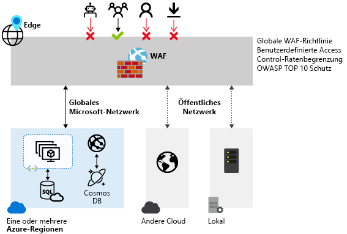

# Was ist die Azure Web Application Firewall?

Die Web Application Firewall (WAF) bietet zentralisierten Schutz Ihrer Webanwendungen vor verbreiteten Exploits und Sicherheitsrisiken. Webanwendungen sind zunehmend Ziele böswilliger Angriffe, die allgemein bekannte Sicherheitslücken ausnutzen. Einschleusung von SQL-Befehlen und websiteübergreifendes Skripting gehören zu den häufigsten Angriffen.

Es ist schwierig, solche Angriffe im Anwendungscode zu verhindern. Hierzu können rigorose Wartungs-, Patch- und Überwachungsmaßnahmen auf mehreren Ebenen der Anwendungstopologie erforderlich sein. Eine zentrale Web Application Firewall vereinfacht die Sicherheitsverwaltung erheblich. Eine WAF bietet auch Anwendungsadministratoren eine bessere Gewähr des Schutzes vor Bedrohungen und Angriffen.

Mit einer WAF-Lösung können Sie schneller auf ein Sicherheitsrisiko reagieren, da eine bekannte Schwachstelle an einem zentralen Ort gepatcht wird, statt jede einzelne Webanwendung separat zu sichern.

WAF kann mit Azure Application Gateway und Azure Front Door Service bereitgestellt werden. Zurzeit verfügt WAF über Features, die für jeden spezifischen Dienst angepasst werden. Weitere Informationen zu den WAF-Features für die einzelnen Dienste finden Sie in der Übersicht zu den einzelnen Diensten.

## Nächste Schritte

- Weitere Informationen zu Web Application Firewall auf Application Gateway finden Sie unter [Web Application Firewall auf Azure Application Gateway](./ag/ag-overview.md).
- Weitere Informationen zu Web Application Firewall auf Azure Front Door Service finden Sie unter [Web Application Firewall auf Azure Front Door Service](./afds/afds-overview.md).
