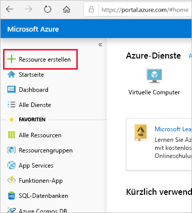
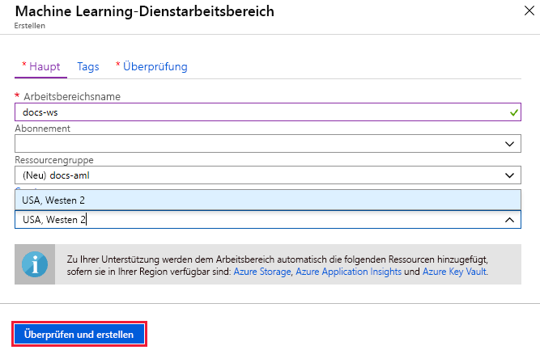
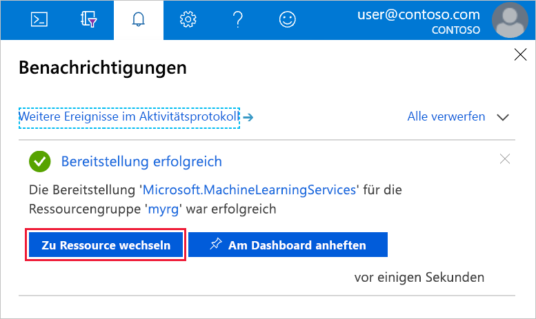

1. Melden Sie sich mit den Anmeldeinformationen, die Sie für das Azure-Abonnement verwenden, beim [Azure-Portal](https://portal.azure.com/) an. 

   

1. Wählen Sie links oben im Portal **Ressource erstellen** aus.

   

1. Wählen Sie mithilfe der Suchleiste **Machine Learning-Dienstarbeitsbereich** aus.

   

1. Wählen Sie im Bereich **ML-Dienstarbeitsbereich** die Option **Erstellen** aus, um zu beginnen.

    

1. Konfigurieren Sie Ihren Arbeitsbereich im Bereich **ML-Dienstarbeitsbereich**.

    

   Feld|BESCHREIBUNG
   ---|---
   Arbeitsbereichname |Geben Sie einen eindeutigen Namen ein, der Ihren Arbeitsbereich identifiziert. In diesem Beispiel verwenden wir **docs-ws**. Namen müssen in der Ressourcengruppe eindeutig sein. Verwenden Sie einen Namen, der leicht zu merken ist und sich von den von anderen Benutzern erstellten Arbeitsbereichen unterscheidet.  
   Subscription |Wählen Sie das gewünschte Azure-Abonnement aus.
   Resource group | Verwenden Sie eine vorhandene Ressourcengruppe in Ihrem Abonnement, oder geben Sie einen Namen ein, um eine neue Ressourcengruppe zu erstellen. Eine Ressourcengruppe enthält verwandte Ressourcen für eine Azure-Lösung. In diesem Beispiel verwenden wir **docs-aml**. 
   Location | Wählen Sie den Standort aus, der Ihren Benutzern und den Datenressourcen am nächsten ist. Dort wird der Arbeitsbereich erstellt.

1. Überprüfen Sie Ihre Arbeitsbereichskonfiguration, und wählen Sie **Erstellen** aus. Es kann einige Augenblicke dauern, bis der Arbeitsbereich erstellt wurde.

1. Wenn der Vorgang abgeschlossen ist, wird eine Erfolgsmeldung zur Bereitstellung angezeigt. Diese finden Sie auch im Abschnitt „Benachrichtigungen“. Um den neuen Arbeitsbereich anzuzeigen, wählen Sie **Zu Ressource wechseln** aus.

   
