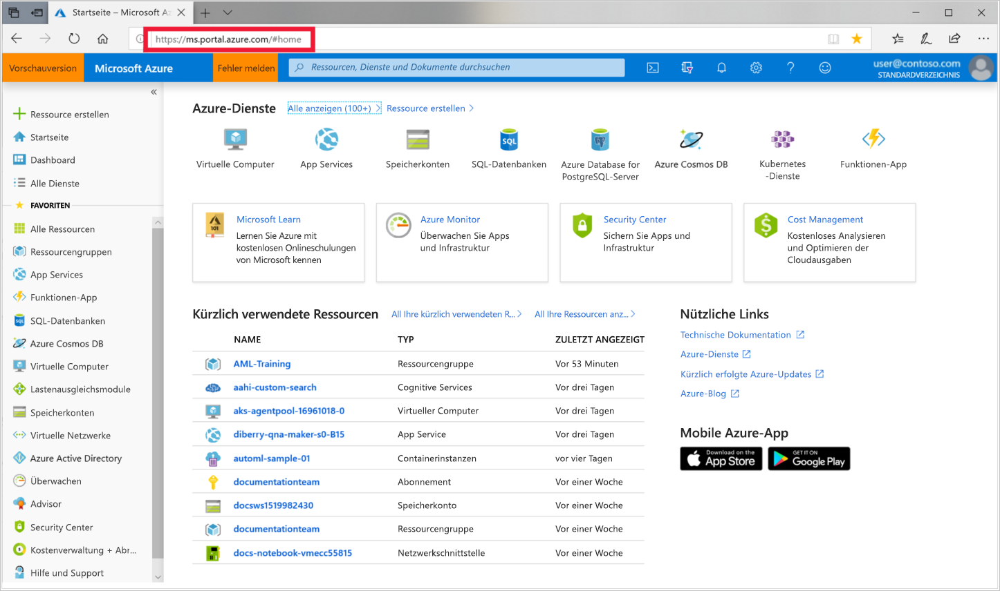
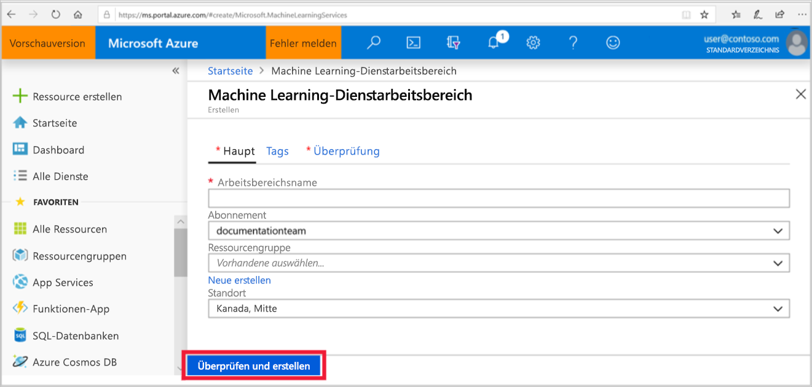

1. Melden Sie sich mit den Anmeldeinformationen, die Sie für das Azure-Abonnement verwenden, beim [Azure-Portal](https://portal.azure.com/) an. 

   

1. Wählen Sie links oben im Portal **Ressource erstellen** aus.

   

1. Geben Sie in der Suchleiste **Machine Learning** ein. Wählen Sie das Suchergebnis **Machine Learning-Dienstarbeitsbereich** aus.

   

1. Wählen Sie im Bereich **ML-Dienstarbeitsbereich** die Option **Erstellen** aus, um zu beginnen.

    

1. Konfigurieren Sie Ihren Arbeitsbereich im Bereich **ML-Dienstarbeitsbereich**.

   Feld|BESCHREIBUNG
   ---|---
   Arbeitsbereichname |Geben Sie einen eindeutigen Namen ein, der Ihren Arbeitsbereich identifiziert. In diesem Beispiel verwenden wir **docs-ws**. Namen müssen in der Ressourcengruppe eindeutig sein. Verwenden Sie einen Namen, der leicht zu merken ist und sich von den von anderen Benutzern erstellten Arbeitsbereichen unterscheidet.  
   Abonnement |Wählen Sie das gewünschte Azure-Abonnement aus.
   Ressourcengruppe | Verwenden Sie eine vorhandene Ressourcengruppe in Ihrem Abonnement, oder geben Sie einen Namen ein, um eine neue Ressourcengruppe zu erstellen. Eine Ressourcengruppe enthält verwandte Ressourcen für eine Azure-Lösung. In diesem Beispiel verwenden wir **docs-aml**. 
   Location | Wählen Sie den Standort aus, der Ihren Benutzern und den Datenressourcen am nächsten ist. Dort wird der Arbeitsbereich erstellt.

   

1. Wählen Sie **Überprüfen und erstellen** aus, um den Erstellungsprozess zu starten.

    

1. Überprüfen Sie Ihre Arbeitsbereichskonfiguration. Ist sie korrekt, wählen Sie **Erstellen** aus. Es kann einige Augenblicke dauern, bis der Arbeitsbereich erstellt wurde.

    

1. Um den Status der Bereitstellung zu überprüfen, wählen Sie das Benachrichtigungssymbol (**Glocke**) in der Symbolleiste aus.

1. Wenn der Vorgang abgeschlossen ist, wird eine Erfolgsmeldung zur Bereitstellung angezeigt. Diese finden Sie auch im Abschnitt „Benachrichtigungen“. Um den neuen Arbeitsbereich anzuzeigen, wählen Sie **Zu Ressource wechseln** aus.

   
