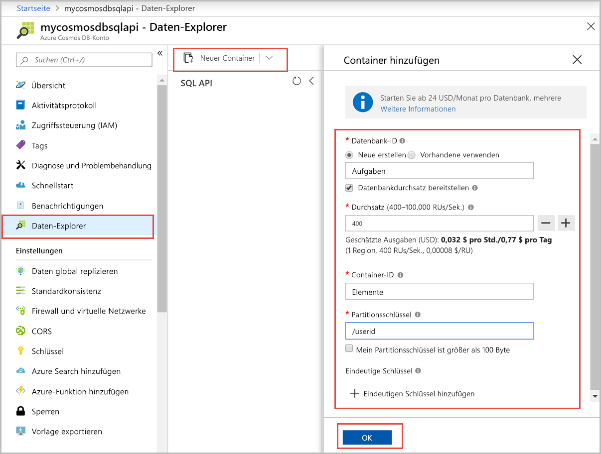

Sie können nun mithilfe des Daten-Explorer-Tools im Azure-Portal eine Datenbank und einen Container erstellen. 

1. Wählen Sie **Daten-Explorer** > **Neuer Container** aus. 
    
    Der Bereich **Container hinzufügen** wird ganz rechts angezeigt. Möglicherweise müssen Sie nach rechts scrollen, damit Sie ihn sehen.

    

2. Geben Sie auf der Seite **Container hinzufügen** die Einstellungen für den neuen Container ein.

    |Einstellung|Empfohlener Wert|BESCHREIBUNG
    |---|---|---|
    |**Datenbank-ID**|Aufgaben|Geben Sie *ToDoList* als Namen für die neue Datenbank ein. Datenbanknamen müssen zwischen 1 und 255 Zeichen lang sein und dürfen weder `/, \\, #, ?` noch nachgestellte Leerzeichen enthalten. Aktivieren Sie die Option **Provision database throughput** (Datenbankdurchsatz bereitstellen). Diese Option ermöglicht es Ihnen, den für die Datenbank bereitgestellten Durchsatz auf alle Container in der Datenbank zu verteilen. Darüber hinaus hilft sie Ihnen dabei, Kosten zu sparen. |
    |**Durchsatz**|400|Belassen Sie den Durchsatz bei 400 Anforderungseinheiten pro Sekunde (RU/s). Sie können den Durchsatz später zentral hochskalieren, wenn Sie Wartezeiten reduzieren möchten.| 
    |**Container-ID**|Items|Geben Sie *Items* als Namen für den neuen Container ein. Für Container-IDs gelten dieselben Zeichenanforderungen wie für Datenbanknamen.|
    |**Partitionsschlüssel**| /category| Das in diesem Artikel beschriebene Beispiel verwendet */category* als Partitionsschlüssel.|
    
    Zusätzlich zu den zuvor beschriebenen Einstellungen können Sie optional auch **eindeutige Schlüssel** für den Container hinzufügen. In diesem Beispiel lassen wir das Feld leer. Eindeutige Schlüssel bieten Entwicklern die Möglichkeit, ihrer Datenbank eine zusätzliche Datenintegritätsebene hinzuzufügen. Durch das Erstellen einer Richtlinie für eindeutige Schlüssel beim Erstellen eines Containers wird die Eindeutigkeit von einem oder mehreren Werten pro Partitionsschlüssel gewährleistet. Weitere Informationen finden Sie im Artikel [Eindeutige Schlüssel in Azure Cosmos DB](../articles/cosmos-db/unique-keys.md).
    
    Klicken Sie auf **OK**. Im Daten-Explorer werden die neue Datenbank und der neue Container angezeigt.