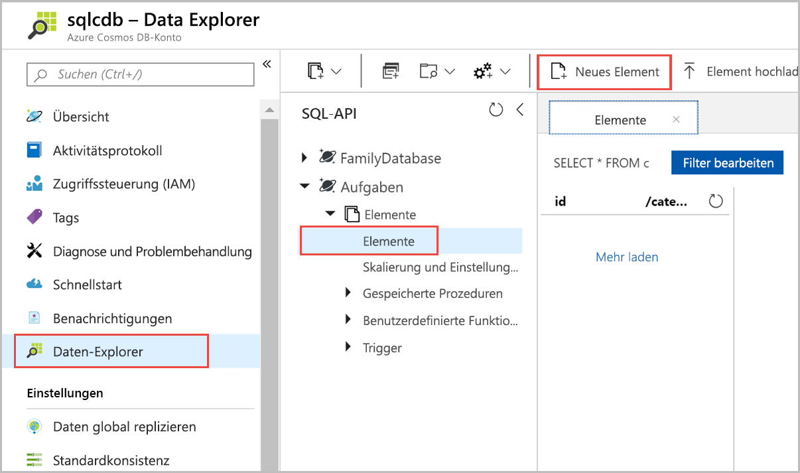
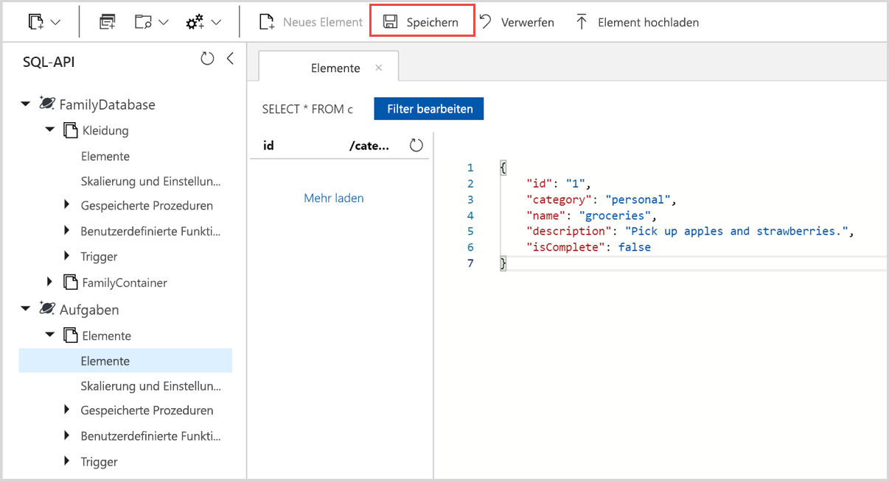

Sie können jetzt mithilfe des Daten-Explorers Daten zu Ihrem neuen Container hinzufügen.

1. Erweitern Sie im **Daten-Explorer** die Datenbank **Tasks** und dann den Container **Items**. Wählen Sie **Elemente** und dann **Neues Element** aus.

   
  
2. Fügen Sie nun dem Container ein Dokument mit folgender Struktur hinzu.

     ```json
     {
         "id": "1",
         "category": "personal",
         "name": "groceries",
         "description": "Pick up apples and strawberries.",
         "isComplete": false
     }
     ```

3. Nachdem Sie den JSON-Code auf der Registerkarte **Dokumente** hinzugefügt haben, klicken Sie auf **Speichern**.

    

4.  Erstellen und speichern Sie ein weiteres Dokument, in das Sie einen eindeutigen Wert für die Eigenschaft `id` einfügen, und ändern Sie die anderen Eigenschaften nach Bedarf. Ihre neuen Dokumente können jede gewünschte Struktur aufweisen, da Azure Cosmos DB kein Schema für Ihre Daten vorgibt.