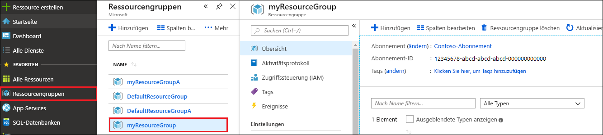

Wenn Sie Ihre Web-App und das Azure Cosmos DB-Konto fertiggestellt haben, können Sie die erstellten Azure-Ressourcen löschen, damit keine weiteren Gebühren anfallen. So löschen Sie die Ressourcen:

1. Wählen Sie ganz links im Azure-Portal **Ressourcengruppen** aus. Wenn das linke Menü reduziert ist, wählen Sie die Schaltfläche  aus, um es zu erweitern.

2. Wählen Sie die Ressourcengruppe aus, die Sie für diesen Schnellstart erstellt haben.  

   

2. Wählen Sie im neuen Fenster **Ressourcengruppe löschen** aus.

      

3. Geben Sie in dem nächsten Fenster den Namen der zu löschenden Ressourcengruppe ein, und wählen Sie dann **Löschen** aus.

