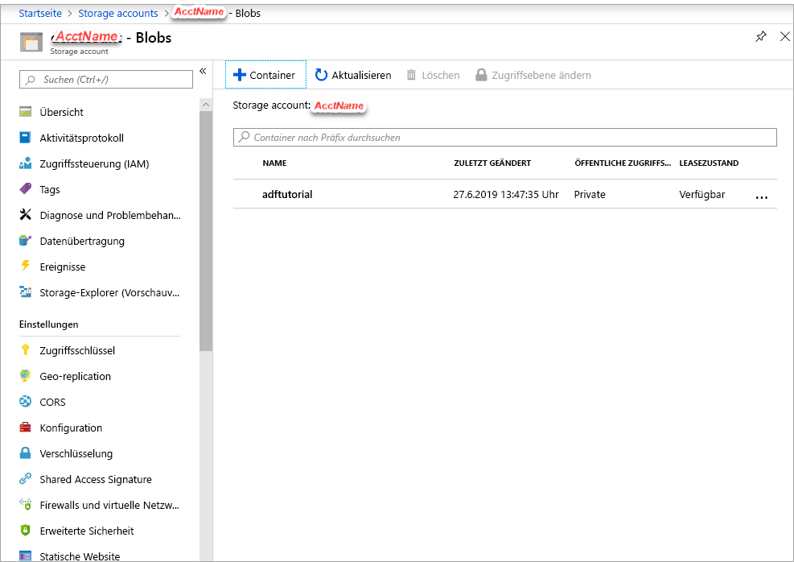
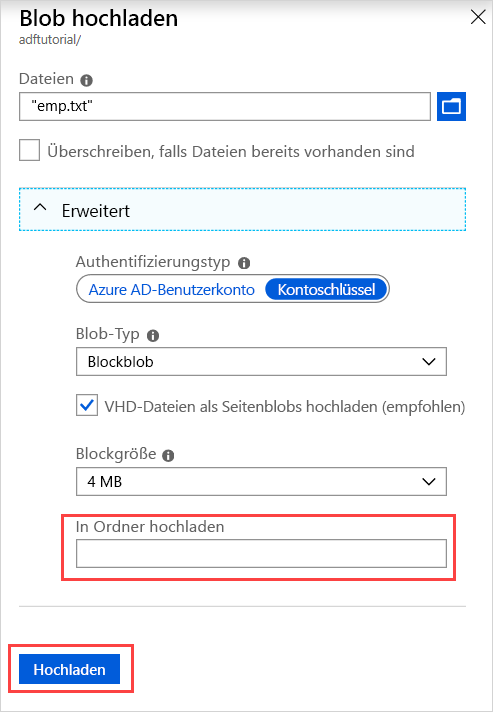

## <a name="prerequisites"></a>Voraussetzungen

### <a name="azure-subscription"></a>Azure-Abonnement
Wenn Sie kein Azure-Abonnement besitzen, können Sie ein [kostenloses Konto](https://azure.microsoft.com/free/) erstellen, bevor Sie beginnen.

### <a name="azure-roles"></a>Azure-Rollen
Damit Sie Data Factory-Instanzen erstellen können, muss das Benutzerkonto, mit dem Sie sich bei Azure anmelden, ein Mitglied der Rolle *Mitwirkender* oder *Besitzer* oder ein *Administrator* des Azure-Abonnements sein. Wenn Sie die Berechtigungen anzeigen möchten, über die Sie im Abonnement verfügen, wechseln Sie zum [Azure-Portal](https://portal.azure.com), wählen Sie in der oberen rechten Ecke Ihren Benutzernamen aus, wählen Sie **Weitere Optionen** (...) aus, und wählen Sie dann **Meine Berechtigungen** aus. Wenn Sie Zugriff auf mehrere Abonnements besitzen, wählen Sie das entsprechende Abonnement aus.

Für das Erstellen und Verwalten von untergeordneten Ressourcen für Data Factory – z.B. Datasets, verknüpfte Dienste, Pipelines, Trigger und Integration Runtimes – gelten die folgenden Anforderungen:

- Für das Erstellen und Verwalten von untergeordneten Ressourcen im Azure-Portal müssen Sie auf Ressourcengruppenebene oder höher Mitglied der Rolle **Mitwirkender von Data Factory** sein.
- Zum Erstellen und Verwalten von untergeordneten Ressourcen mit PowerShell oder dem SDK auf Ressourcenebene oder höher ist die Rolle **Mitwirkender** ausreichend.

Eine Beispielanleitung zum Hinzufügen eines Benutzers zu einer Rolle finden Sie im Artikel [Hinzufügen oder Ändern von Azure-Administratorrollen, die das Abonnement oder die Dienste verwalten](../articles/billing/billing-add-change-azure-subscription-administrator.md).

Weitere Informationen finden Sie in den folgenden Artikeln:

- [Rolle „Mitwirkender von Data Factory“](../articles/role-based-access-control/built-in-roles.md#data-factory-contributor)
- [Roles and permissions for Azure Data Factory](../articles/data-factory/concepts-roles-permissions.md) (Rollen und Berechtigungen für Azure Data Factory)

### <a name="azure-storage-account"></a>Azure-Speicherkonto
Sie verwenden in diesem Schnellstart ein allgemeines Azure-Speicherkonto (Blobspeicher) als Datenspeicher vom Typ *Quelle* und vom Typ *Ziel*. Falls Sie noch nicht über ein allgemeines Azure-Speicherkonto verfügen, lesen Sie zum Erstellen die Informationen unter [Erstellen Sie ein Speicherkonto](../articles/storage/common/storage-quickstart-create-account.md). 

#### <a name="get-the-storage-account-name"></a>Abrufen des Speicherkontonamens
In dieser Schnellstartanleitung benötigen Sie den Namen Ihres Azure-Speicherkontos. Das folgende Verfahren enthält die Schritte zum Abrufen des Namens für Ihr Speicherkonto: 

1. Navigieren Sie in einem Webbrowser zum [Azure-Portal](https://portal.azure.com), und melden Sie sich mit Ihrem Azure-Benutzernamen und dem zugehörigen Kennwort an.
2. Wählen Sie im Menü des Azure-Portals die Option **Alle Dienste** und anschließend **Storage** > **Speicherkonten** aus. Alternativ können Sie auf einer beliebigen Seite nach *Speicherkonten* suchen und die entsprechende Option auswählen.
3. Filtern Sie auf der Seite **Speicherkonten** nach Ihrem Speicherkonto (falls erforderlich), und wählen Sie dann Ihr Speicherkonto aus. 

Alternativ können Sie auf einer beliebigen Seite nach *Speicherkonten* suchen und die entsprechende Option auswählen.

#### <a name="create-a-blob-container"></a>Erstellen eines Blobcontainers
In diesem Abschnitt erstellen Sie einen Blobcontainer mit dem Namen **adftutorial** in Azure Blob Storage.

1. Wählen Sie auf der Seite „Speicherkonto“ die Optionen **Übersicht** > **Blobs** aus.
2. Wählen Sie auf der Symbolleiste der Seite *\<Kontoname>*  - **Blobs** die Option **Container** aus.
3. Geben Sie im Dialogfeld **Neuer Container** als Namen **adftutorial** ein, und klicken Sie auf **OK**. Die Seite *\<Kontoname>*  - **Blobs** wird aktualisiert, woraufhin die Liste der Container den Eintrag **adftutorial** enthält.

   

#### <a name="add-an-input-folder-and-file-for-the-blob-container"></a>Hinzufügen eines Eingabeordners und einer Datei für den Blobcontainer
In diesem Abschnitt erstellen Sie einen Ordner mit dem Namen **input** in dem Container, den Sie soeben erstellt haben, und laden eine Beispieldatei in den Eingabeordner hoch. Öffnen Sie zunächst einen Text-Editor wie **Notepad**, und erstellen Sie eine Datei mit dem Namen **emp.txt** und folgendem Inhalt:

```emp.txt
John, Doe
Jane, Doe
```

Speichern Sie die Datei im Ordner **C:\ADFv2QuickStartPSH**. (Erstellen Sie den Ordner, falls er noch nicht vorhanden ist.) Kehren Sie dann zum Azure-Portal zurück, und führen Sie die folgenden Schritte aus:

1. Wählen Sie auf der Seite *\<Kontoname>*  - **Blobs**, auf der Sie Ihre Arbeit unterbrochen haben, in der aktualisierten Liste der Container den Eintrag **adftutorial** aus.

   1. Falls Sie das Fenster geschlossen oder zu einer anderen Seite gewechselt haben, melden Sie sich erneut beim [Azure-Portal](https://portal.azure.com) an.
   1. Wählen Sie im Menü des Azure-Portals die Option **Alle Dienste** und anschließend **Storage** > **Speicherkonten** aus. Alternativ können Sie auf einer beliebigen Seite nach *Speicherkonten* suchen und die entsprechende Option auswählen.
   1. Wählen Sie Ihr Speicherkonto und anschließend **Blobs** > **adftutorial** aus.

2. Wählen Sie auf der Symbolleiste der Seite des Containers **adftutorial** die Option **Hochladen** aus.
3. Wählen Sie auf der Seite **Blob hochladen** das Feld **Dateien** aus. Navigieren Sie zur Datei **emp.txt**, und wählen Sie dann die Datei aus.
4. Erweitern Sie die Überschrift **Erweitert**. Die Seite wird jetzt wie folgt angezeigt:

   
5. Geben Sie im Feld **In Ordner hochladen** den Namen **input** ein.
6. Wählen Sie die Schaltfläche **Hochladen**. Daraufhin sollten in der Liste die Datei **emp.txt** und der Status des Uploads angezeigt werden.
7. Wählen Sie das Symbol **Schließen** (das **X**) aus, um die Seite **Blob hochladen** zu schließen.

Lassen Sie die Seite des Containers **adftutorial** geöffnet. Sie überprüfen darauf am Ende dieser Schnellstartanleitung die Ausgabe.