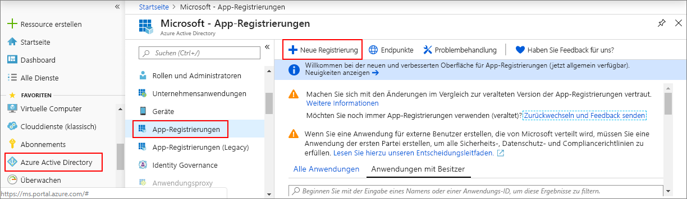
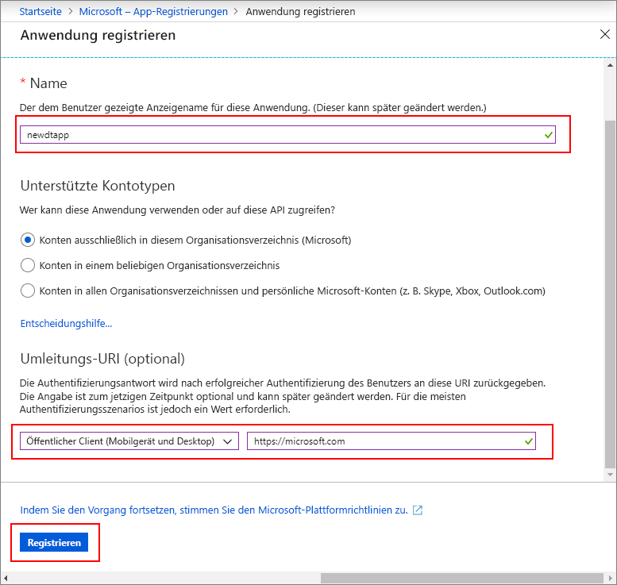
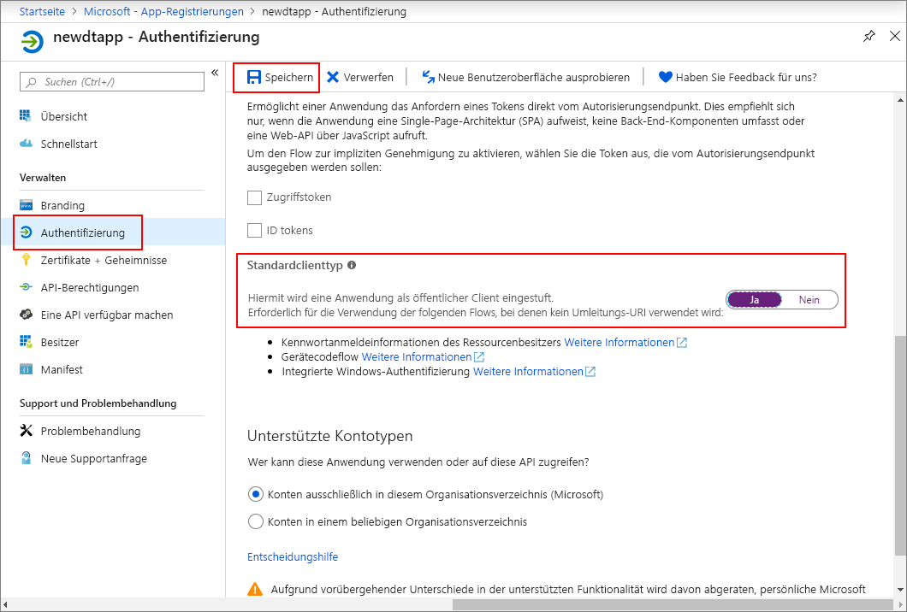
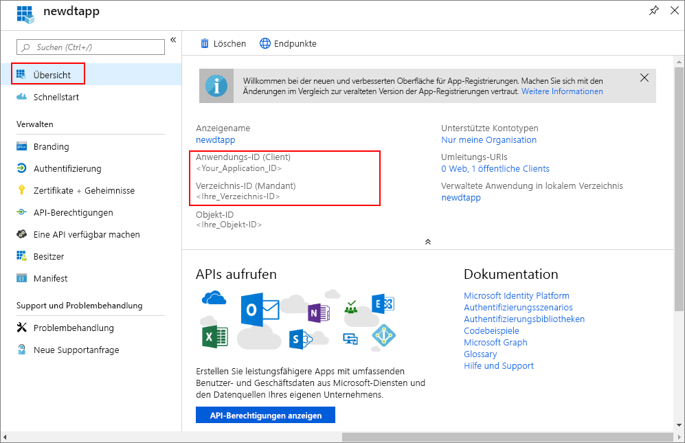
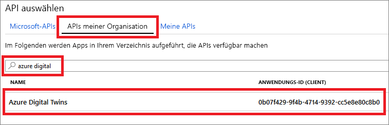
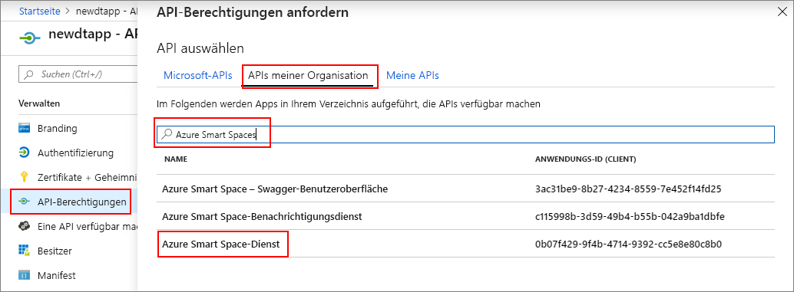
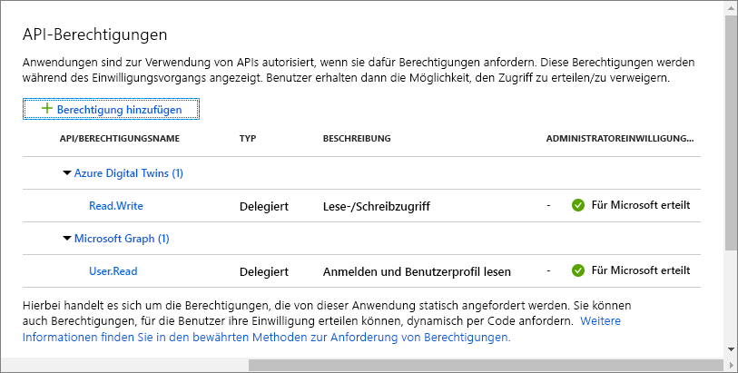

>[!NOTE]
>Dieser Abschnitt enthält Anweisungen für die neue [Azure AD-App-Registrierung](https://docs.microsoft.com/azure/active-directory/develop/quickstart-register-app). Wenn Sie noch über eine ältere native App-Registrierung verfügen, können Sie diese verwenden, solange sie unterstützt wird. Wenn aus irgendeinem Grund die neue Art der App-Registrierung in Ihrem Setup nicht funktioniert, können Sie außerdem versuchen, eine ältere native AAD-App zu erstellen. Lesen Sie für weitere Anweisungen [Registrieren Ihrer Azure Digital Twins-App mit älterem Azure Active Directory](../articles/digital-twins/how-to-use-legacy-aad.md). 

1. Öffnen Sie im [Azure-Portal](https://portal.azure.com) im linken Bereich **Azure Active Directory**, und öffnen Sie dann den Bereich **App-Registrierungen**. Klicken Sie auf die Schaltfläche **Neue Registrierung**.

    

1. Geben Sie im Feld **Name** einen Anzeigenamen für diese App-Registrierung ein. Wählen Sie im Abschnitt **Umleitungs-URI (optional)** **öffentlicher Client (mobil & Desktop)** im Dropdownmenü auf der linken Seite, und geben Sie `https://microsoft.com` in das Textfeld auf der rechten Seite ein. Wählen Sie **Registrieren**.

    

1. Um sicherzustellen, dass [die App als *native App*](https://docs.microsoft.com/azure/active-directory/develop/scenario-desktop-app-registration) registriert ist, öffnen Sie den Bereich **Authentifizierung** für Ihre App-Registrierung, und scrollen Sie in diesem Bereich nach unten. Wählen Sie im Abschnitt **Standardclienttyp** **Ja** für **Anwendung als öffentlichen Client behandeln**. 

    

1.  Öffnen Sie den Bereich **Übersicht** Ihrer registrierten App, und kopieren Sie die Werte der folgenden Elemente in eine temporäre Datei. Mit diesen Werten konfigurieren Sie in den folgenden Abschnitten Ihre Beispielanwendung.

    - **Anwendungs-ID (Client)**
    - **Verzeichnis-ID (Mandant)**

    

1. Öffnen Sie den Bereich **API-Berechtigungen** für Ihre App-Registrierung. Wählen Sie die Schaltfläche **Berechtigung hinzufügen** aus. Wählen Sie im Bereich **API-Berechtigungen anfordern**  die Registerkarte **Von meiner Organisation verwendete APIs** aus, und suchen Sie dann nach
    
    1. **Azure Digital Twins**. Wählen Sie die API **Azure Digital Twins** aus.

        

    1. Suchen Sie alternativ nach **Azure Smart Spaces**. Wählen Sie die API **Azure Smart Spaces Service** aus.

        

    > [!NOTE]
    > Der genaue Name, der bei der Suche angezeigt wird, variiert unter Umständen abhängig vom Mandanten, dem Sie angehören.

1. Die ausgewählte API wird als **Azure Digital Twins** im gleichen Bereich **API-Berechtigungen anfordern** angezeigt. Aktivieren Sie das Dropdownmenü **Lesen (1)** und dann das Kontrollkästchen **Read.Write**. Wählen Sie die Schaltfläche **Berechtigungen hinzufügen** aus.

    

1. Je nach Einstellungen Ihrer Organisation müssen Sie möglicherweise zusätzliche Schritte unternehmen, um dem Administrator Zugriff auf diese API zu gewähren. Weitere Informationen erhalten Sie von Ihrem Administrator. Sobald der Administratorzugriff genehmigt wurde, wird die Spalte **ADMINISTRATOREINWILLIGUNG ERFORDERLICH** im Bereich **API-Berechtigungen** ähnlich wie folgt für Ihre APIs angezeigt:

    

