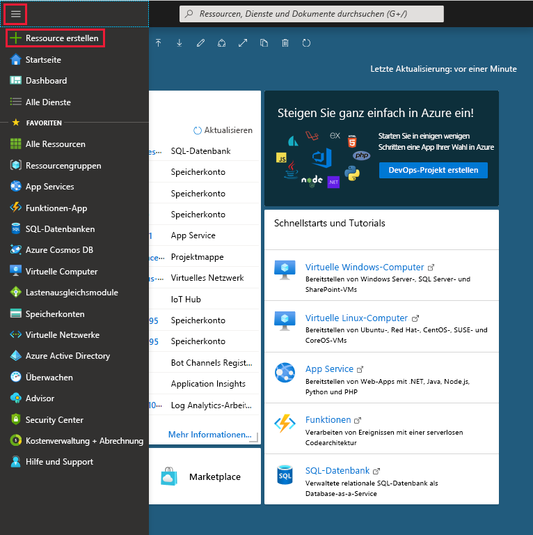

1. Wählen Sie im Azure-Portalmenü die Option **Ressource erstellen** aus.

    

1. Wählen Sie auf der Seite **Neu** die Option **Compute** > **Funktions-App** aus.

1. Verwenden Sie die in der Tabelle unter der Abbildung angegebenen Einstellungen für die Funktions-App.

    

    | Einstellung      | Empfohlener Wert  | BESCHREIBUNG |
    | ------------ | ---------------- | ----------- |
    | **Abonnement** | Ihr Abonnement | Das Abonnement, unter dem diese neue Funktions-App erstellt wird. |
    | **[Ressourcengruppe](../articles/azure-resource-manager/resource-group-overview.md)** |  *myResourceGroup* | Der Name der neuen Ressourcengruppe, in der die Funktionen-App erstellt wird |
    | **Name der Funktions-App** | Global eindeutiger Name | Der Name, der Ihre neue Funktionen-App bezeichnet Gültige Zeichen sind `a-z` (Groß-/Kleinschreibung nicht beachtet), `0-9` und `-`.  |
    |**Veröffentlichen**| Code | Option zum Veröffentlichen von Codedateien oder eines Docker-Containers. |
    | **Laufzeitstapel** | Bevorzugte Sprache | Wählen Sie eine Runtime aus, die Ihre bevorzugte Programmiersprache für Funktionen unterstützt. Wählen Sie **.NET** für C#- und F#-Funktionen aus. |
    |**Region**| Bevorzugte Region | Wählen Sie eine [Region](https://azure.microsoft.com/regions/) in Ihrer Nähe oder in der Nähe von anderen Diensten aus, auf die Ihre Funktionen zugreifen. |

    Wählen Sie die Schaltfläche **Weiter: Hosting >** aus.

1. Geben Sie die folgenden Einstellungen für das Hosting ein.

    

    | Einstellung      | Empfohlener Wert  | BESCHREIBUNG |
    | ------------ | ---------------- | ----------- |
    | **[Speicherkonto](../articles/storage/common/storage-quickstart-create-account.md)** |  Global eindeutiger Name |  Erstellen Sie ein Speicherkonto, das von Ihrer Funktions-App verwendet wird. Speicherkontonamen müssen zwischen 3 und 24 Zeichen lang sein und dürfen nur Zahlen und Kleinbuchstaben enthalten. Sie können auch ein vorhandenes Konto verwenden, das die [Anforderungen an das Speicherkonto](../articles/azure-functions/functions-scale.md#storage-account-requirements) erfüllen muss. |
    |**Betriebssystem**| Bevorzugtes Betriebssystem | Ein Betriebssystem ist für Sie basierend auf Ihrer Runtimestapelauswahl vorab ausgewählt, aber Sie können die Einstellung ggf. ändern. |
    | **[Plan](../articles/azure-functions/functions-scale.md)** | Verbrauchsplan | Der Hostingplan, der definiert, wie Ihre Ressourcen der Funktionen-App zugewiesen werden Im **Standard-Verbrauchstarif** werden Ressourcen je nach Bedarf der Funktionen dynamisch hinzugefügt. Beim [serverlosen Hosting](https://azure.microsoft.com/overview/serverless-computing/) bezahlen Sie nur die Zeit, in der Ihre Funktionen ausgeführt werden. Bei der Ausführung in einem App Service-Plan müssen Sie die [Skalierung Ihrer Funktions-App](../articles/azure-functions/functions-scale.md) verwalten.  |

    Wählen Sie die Schaltfläche **Weiter: Überwachung >** aus.

1. Geben Sie die folgenden Einstellungen für die Überwachung ein.

    

    | Einstellung      | Empfohlener Wert  | BESCHREIBUNG |
    | ------------ | ---------------- | ----------- |
    | **[Application Insights](../articles/azure-functions/functions-monitoring.md)** | Standard | Erstellt eine Application Insights-Ressource mit dem gleichen *App-Namen* in der nächstgelegenen unterstützten Region. Durch Erweitern dieser Einstellung können Sie den **neuen Ressourcennamen** ändern oder einen anderen **Standort** in einer [Azure-Region](https://azure.microsoft.com/global-infrastructure/geographies/) wählen, in der Sie Ihre Daten speichern möchten. |

    Wählen Sie **Überprüfen + erstellen** aus, um die App-Konfigurationsauswahl zu überprüfen.

1. Klicken Sie auf **Erstellen**, um die Funktionen-App bereitzustellen.

1. Wählen Sie oben rechts im Portal das Benachrichtigungssymbol aus, und achten Sie auf die Meldung **Bereitstellung erfolgreich**.

    

1. Wählen Sie **Zu Ressource wechseln**, um Ihre neue Funktionen-App anzuzeigen. Sie können auch die Option **An Dashboard anheften** auswählen. Wenn Sie die Funktions-App anheften, können Sie einfacher über das Dashboard auf sie zugreifen.
