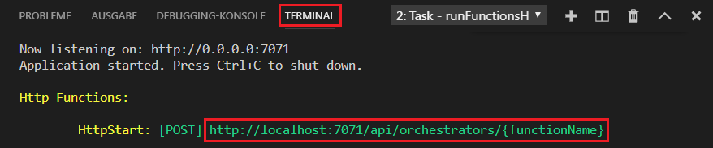

## Lokales Ausführen der Funktion

Mit Azure Functions Core-Tools können Sie ein Azure Functions-Projekt auf dem lokalen Entwicklungscomputer ausführen.

1. Legen Sie zum Testen der Funktion einen Breakpoint im Funktionscode fest, und drücken Sie F5, um das Funktions-App-Projekt zu starten. Die Ausgabe der Core Tools wird im Bereich **Terminal** angezeigt.

1. Kopieren Sie im Bereich **Terminal** den URL-Endpunkt Ihrer über HTTP ausgelösten Funktion. Diese URL enthält den Funktionsschlüssel, der an den `code`-Abfrageparameter übergeben wird.

    

1. Fügen Sie die URL der HTTP-Anforderung in die Adresszeile des Browsers ein. Hängen Sie anschließend die Abfragezeichenfolge `?name=<yourname>` an diese URL an, und führen Sie die Anforderung aus. Die Ausführung wird angehalten, wenn der Breakpoint erreicht wird.

1. Wenn Sie die Ausführung fortsetzen, sehen Sie nachfolgend die Antwort des Browsers auf die GET-Anforderung:

    

1. Drücken Sie UMSCHALT+F5, um das Debuggen zu beenden.