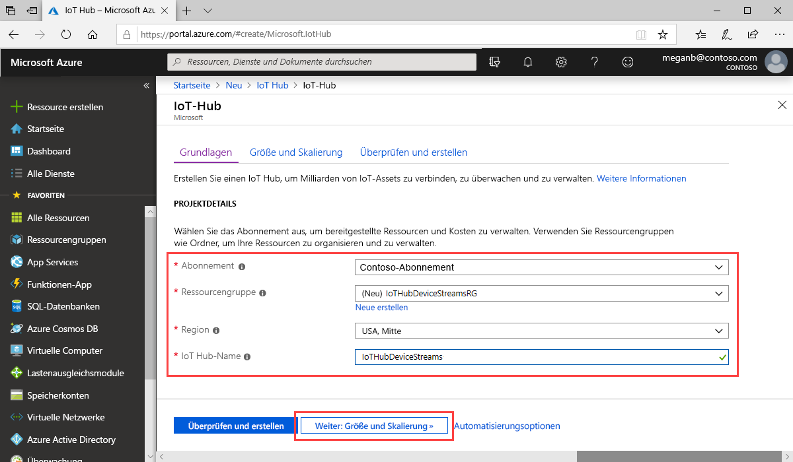

In diesem Abschnitt wird beschrieben, wie Sie über das [Azure-Portal](https://portal.azure.com) einen IoT-Hub erstellen:

1. Melden Sie sich beim [Azure-Portal](https://portal.azure.com) an.

1. Wählen Sie **Ressource erstellen** aus, und geben Sie dann ins Feld **Marketplace durchsuchen** den Begriff *IoT Hub* ein.

1. Wählen Sie in den Suchergebnissen **IoT Hub** und dann **Erstellen** aus.

1. Füllen Sie auf der Registerkarte **Grundlegende Einstellungen** die Felder wie folgt aus:

   - **Abonnement**: Wählen Sie das Abonnement aus, das Sie für Ihren Hub verwenden möchten.

   - **Ressourcengruppe**: Wählen Sie eine vorhandene Ressourcengruppe aus, oder erstellen Sie eine neue. Wählen Sie zum Erstellen einer neuen Ressourcengruppe die Option **Neu erstellen** aus, und geben Sie den Namen ein, den Sie verwenden möchten. Wenn Sie eine vorhandene Ressourcengruppe verwenden möchten, wählen Sie die entsprechende Ressourcengruppe aus. Weitere Informationen finden Sie unter [Verwalten von Azure Resource Manager-Ressourcengruppen](../articles/azure-resource-manager/manage-resource-groups-portal.md).

   - **Region**: Wählen Sie die Region aus, in der sich Ihr Hub befinden soll. Wählen Sie eine Region aus, die die IoT Hub-Gerätestreamsvorschau unterstützt – entweder **USA, Mitte** oder **USA, Mitte (EUAP)** .

   - **IoT Hub-Name**: Geben Sie einen Namen für den Hub ein. Dieser Name muss global eindeutig sein. Wenn der eingegebene Name verfügbar ist, wird ein grünes Häkchen angezeigt.

   

   [!INCLUDE [iot-hub-pii-note-naming-hub](iot-hub-pii-note-naming-hub.md)]

1. Klicken Sie auf **Weiter: Größe und Skalierung**, um die Erstellung Ihres Hubs fortzusetzen.

   

   Unter **Größe und Skalierung** können Sie die Standardeinstellungen übernehmen und am unteren Rand **Überprüfen + erstellen** auswählen. Betrachten Sie die folgenden Optionen:

   - **Tarif und Skalierung**: Ihre ausgewählte Ebene. Wählen Sie einen der Standardtarife (**S1**, **S2** oder **S3**) oder **F1: Free-Tarif** aus. Berücksichtigen Sie bei dieser Entscheidung ggf. auch die Anzahl Ihrer Geräte sowie die zu erwartenden streamingfremden Workloads für Ihren Hub, etwa Telemetrienachrichten. Der kostenlose Tarif ist beispielsweise für Tests und Evaluierungen vorgesehen. Damit kann für 500 Geräte eine Verbindung mit dem IoT Hub hergestellt werden, und bis zu 8.000 Nachrichten pro Tag sind möglich. Jedes Azure-Abonnement kann einen IoT-Hub im kostenlosen Tarif erstellen. 

   - **Anzahl von IoT Hub-Einheiten**: Die Anzahl der pro Einheit und Tag zulässigen Nachrichten hängt von Ihrem Hubtarif ab. Diese Option hängt von der streamingfremden Workload ab, die Sie für Ihren Hub erwarten. Wählen Sie vorerst „1“ aus.

   - **Erweiterte Einstellungen** > **Gerät-zu-Cloud-Partitionen**: Diese Eigenschaft setzt die Gerät-zu-Cloud-Nachrichten in Relation zur Anzahl von gleichzeitigen Lesern der Nachrichten. Die meisten Hubs benötigen nur vier Partitionen.

   Weitere Informationen zu den Tarifoptionen finden Sie unter [Wählen des richtigen IoT Hub-Tarifs für Ihre Lösung](../articles/iot-hub/iot-hub-scaling.md).

1. Wählen Sie **Überprüfen + erstellen** aus, um Ihre Auswahl zu überprüfen. Das Ergebnis sieht etwa wie folgt aus:

   

1. Wählen Sie **Erstellen** aus, um Ihren neuen IoT-Hub zu erstellen. Der Vorgang dauert einige Minuten.
