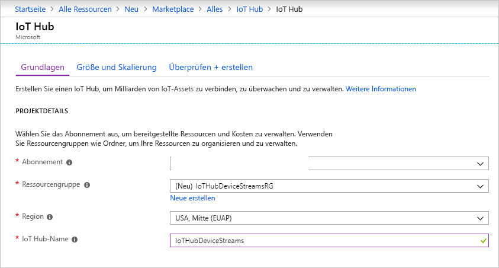
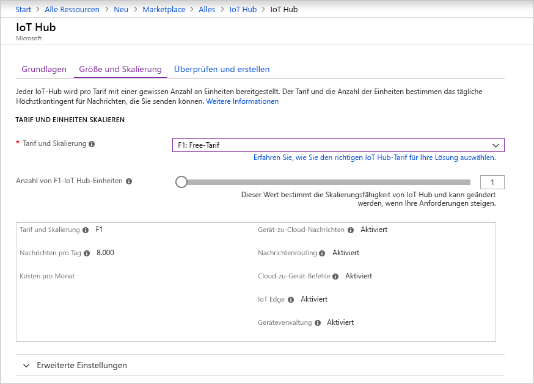
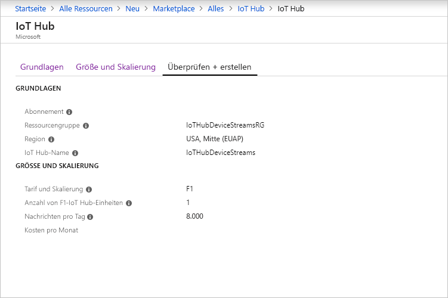

In diesem Abschnitt wird beschrieben, wie Sie über das [Azure-Portal](https://portal.azure.com) einen IoT-Hub erstellen.

1. Melden Sie sich beim [Azure-Portal](https://portal.azure.com) an.

1. Wählen Sie **Ressource erstellen** und dann **Internet der Dinge** aus.

1. Wählen Sie in der Liste auf der rechten Seite **IoT Hub** aus. Daraufhin wird die erste Seite zum Erstellen eines IoT-Hubs angezeigt.

   

   Füllen Sie die Felder aus:

   a. Wählen Sie in der Dropdownliste **Abonnement** das Abonnement aus, das Sie für den IoT-Hub verwenden möchten.

   b. Führen Sie unter **Ressourcengruppe** einen der folgenden Schritte aus: 
      * Wählen Sie zum Erstellen einer neuen Ressourcengruppe **Neu erstellen** aus, und geben Sie den gewünschten Namen ein. 
      * Um eine vorhandene Ressourcengruppe zu verwenden, wählen Sie **Vorhandene verwenden** und dann in der Dropdownliste die Ressourcengruppe aus. 
      
        Weitere Informationen finden Sie unter [Verwalten von Azure Resource Manager-Ressourcengruppen](../articles/azure-resource-manager/manage-resource-groups-portal.md).

   c. Wählen Sie in der Dropdownliste **Region** die Region aus, in der sich Ihr Hub befinden soll. Wählen Sie eine Region aus, die die IoT Hub-Gerätestreamsvorschau unterstützt – entweder **USA, Mitte** oder **USA, Mitte (EUAP)** .

   d. Geben Sie im Feld **IoT Hub-Name** einen Namen für Ihren IoT-Hub ein. Der Name muss global eindeutig sein. Wenn der eingegebene Name verfügbar ist, wird ein grünes Häkchen angezeigt.

   [!INCLUDE [iot-hub-pii-note-naming-hub](iot-hub-pii-note-naming-hub.md)]

1. Wählen Sie **Nächster Schritt: Größe und Skalierung** aus, um die Erstellung Ihres IoT-Hubs fortzusetzen.

   

   In diesem Bereich können Sie die Standardeinstellungen übernehmen und am unteren Rand **Überprüfen + erstellen** auswählen. Betrachten Sie die folgenden Optionen:

   * Wählen Sie in der Dropdownliste **Tarif und Skalierung** einen Standardtarif (**S1**, **S2** oder **S3**) oder **F1: Free-Tarif** aus. Berücksichtigen Sie bei dieser Entscheidung ggf. auch die Anzahl Ihrer Geräte sowie die zu erwartenden streamingfremden Workloads für Ihren Hub (etwa Telemetrienachrichten). Der kostenlose Tarif ist beispielsweise für Tests und Evaluierungen vorgesehen. Damit kann für 500 Geräte eine Verbindung mit dem IoT Hub hergestellt werden, und bis zu 8.000 Nachrichten pro Tag sind möglich. Jedes Azure-Abonnement kann einen IoT-Hub im kostenlosen Tarif erstellen. 

   * **Anzahl von IoT Hub-Einheiten**: Diese Option hängt von der streamingfremden Workload ab, die Sie für Ihren Hub erwarten. Wählen Sie vorerst „1“ aus.

   Weitere Informationen zu den Tarifoptionen finden Sie unter [Wählen des richtigen IoT Hub-Tarifs für Ihre Lösung](../articles/iot-hub/iot-hub-scaling.md).

1. Klicken Sie auf **Überprüfen + erstellen**, um Ihre Auswahl zu überprüfen. Der geöffnete Bereich ähnelt dem folgenden:

   

1. Wählen Sie **Erstellen** aus, um Ihren neuen IoT-Hub zu erstellen. Der Vorgang dauert einige Minuten.
