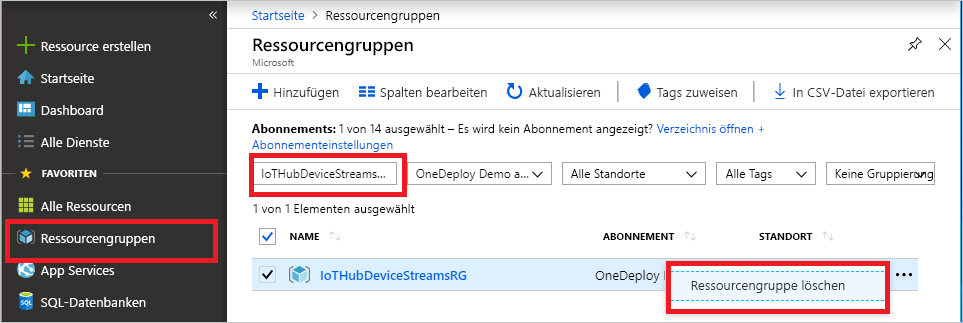

Falls Sie mit dem nächsten empfohlenen Artikel fortfahren möchten, können Sie die bereits erstellten Ressourcen behalten und wiederverwenden.

Andernfalls können Sie die in diesem Artikel erstellten Azure-Ressourcen löschen, um Gebühren zu vermeiden.

> [!IMPORTANT]
> Das Löschen einer Ressourcengruppe kann nicht rückgängig gemacht werden. Die Ressourcengruppe und alle darin enthaltenen Ressourcen werden unwiderruflich gelöscht. Achten Sie daher darauf, dass Sie nicht versehentlich die falsche Ressourcengruppe oder die falschen Ressourcen löschen. Wenn Sie den IoT-Hub in einer bereits vorhandenen Ressourcengruppe erstellt haben, die Ressourcen enthält, die Sie behalten möchten, löschen Sie nicht die Ressourcengruppe, sondern nur die IoT-Hub-Ressource.
>

So löschen Sie eine Ressourcengruppe anhand des Namens:

1. Melden Sie sich beim [Azure-Portal](https://portal.azure.com) an, und wählen Sie anschließend **Ressourcengruppen** aus.

1. Geben Sie im Textfeld **Nach Name filtern** den Namen der Ressourcengruppe ein, die Ihren IoT-Hub enthält.

1. Wählen Sie in der Ergebnisliste rechts neben Ihrer Ressourcengruppe die Auslassungspunkte ( **...** ) und anschließend **Ressourcengruppe löschen** aus.

    

1. Um die Löschung der Ressourcengruppe zu bestätigen, geben Sie erneut den Namen der Ressourcengruppe ein, und wählen Sie dann **Löschen** aus. Nach kurzer Zeit werden die Ressourcengruppe und alle darin enthaltenen Ressourcen gelöscht.
