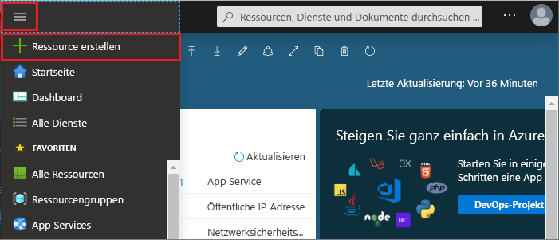
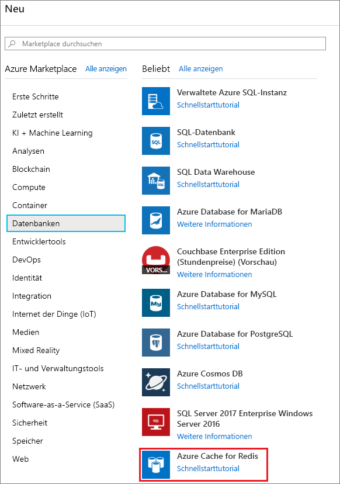
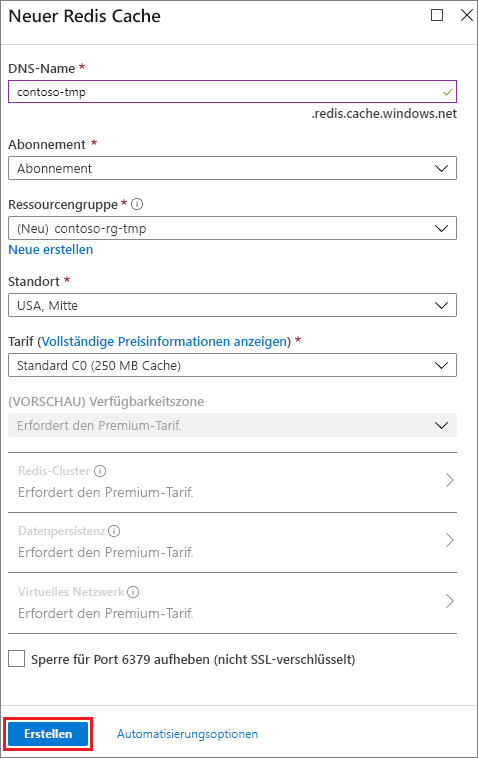
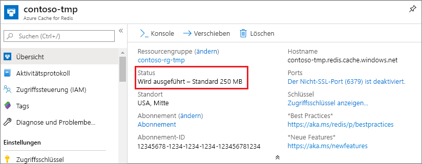

1. Melden Sie sich zum Erstellen eines Caches beim [Azure-Portal](https://portal.azure.com) an, und wählen Sie **Ressource erstellen** aus. 
   
   
   
1. Wählen Sie auf der Seite **Neu** die Option **Datenbanken** und dann **Azure Cache for Redis** aus.
   
   
   
1. Konfigurieren Sie auf der Seite **Neuer Redis Cache** die Einstellungen für den neuen Cache.
   
   | Einstellung      | Empfohlener Wert  | BESCHREIBUNG |
   | ------------ |  ------- | -------------------------------------------------- |
   | **DNS-Name** | Geben Sie einen global eindeutigen Namen ein. | Der Cachename muss zwischen 1 und 63 Zeichen lang sein und darf nur Zahlen, Buchstaben und Bindestriche enthalten. Der Name muss mit einer Zahl oder einem Buchstaben beginnen und enden und darf keine aufeinanderfolgenden Bindestriche enthalten. Der *Hostname* Ihrer Cache-Instanz lautet *\<DNS-Name>.redis.cache.windows.net*. | 
   | **Abonnement** | Öffnen Sie die Dropdownliste, und wählen Sie Ihr Abonnement aus. | Das Abonnement, unter dem diese neue Azure Cache for Redis-Instanz erstellt wird. | 
   | **Ressourcengruppe** | Öffnen Sie die Dropdownliste, und wählen Sie eine Ressourcengruppe aus, oder wählen Sie **Neu erstellen** aus, und geben Sie einen Namen für eine neue Ressourcengruppe ein. | Der Name der Ressourcengruppe, in der Ihr Cache und weitere Ressourcen erstellt werden. Wenn Sie alle Ihre App-Ressourcen in einer Ressourcengruppe zusammenfassen, können Sie sie einfacher gemeinsam verwalten oder löschen. | 
   | **Location** | Öffnen Sie die Dropdownliste, und wählen Sie einen Standort aus. | Wählen Sie eine [Region](https://azure.microsoft.com/regions/) in der Nähe anderer Dienste aus, die Ihren Cache verwenden. |
   | **Preisstufe** | Öffnen Sie die Dropdownliste, und wählen Sie einen [Tarif](https://azure.microsoft.com/pricing/details/cache/) aus. |  Der Tarif bestimmt Größe, Leistung und verfügbare Features für den Cache. Weitere Informationen finden Sie unter [What is Azure Cache for Redis](../articles/azure-cache-for-redis/cache-overview.md) (Was ist Azure Cache for Redis?). |
   
1. Klicken Sie auf **Erstellen**. 
   
    
   
   Es dauert eine Weile, bis der Cache erstellt wird. Sie können den Fortschritt auf der Seite **Übersicht** von Azure Cache for Redis überwachen. Wenn **Wird ausgeführt** als **Status** angezeigt wird, ist der Cache einsatzbereit.
   
   

