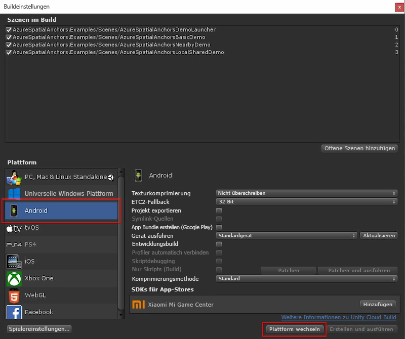

Wählen Sie **Datei** > **Buildeinstellungen** aus, um **Buildeinstellungen** zu öffnen.

Wählen Sie im Abschnitt **Plattform** die Option **Android** aus. Ändern Sie das **Buildsystem** in **Gradle**, und stellen Sie sicher, dass das Kontrollkästchen **Projekt exportieren** kein Häkchen enthält.

Wählen Sie **Plattform wechseln** aus, um die Plattform in **Android** zu ändern. Bei Bedarf werden Sie in Unity zur Installation fehlender unterstützender Android-Komponenten aufgefordert.

Schließen Sie das Fenster **Buildeinstellungen**.

### Herunterladen und Importieren des ARCore SDK für Unity

Laden Sie die Datei `unitypackage` aus den [ARCore SDK-Releases für Unity 1.7](https://github.com/google-ar/arcore-unity-sdk/releases/tag/v1.7.0) herunter. Wählen Sie im Unity-Projekt die Optionen **Ressourcen** > **Paket importieren** > **Benutzerdefiniertes Paket** und anschließend die zuvor heruntergeladene Datei `unitypackage` aus. Vergewissern Sie sich im Dialogfeld zum **Importieren des Unity-Pakets**, dass alle Dateien ausgewählt sind, und wählen Sie dann **Importieren** aus.
